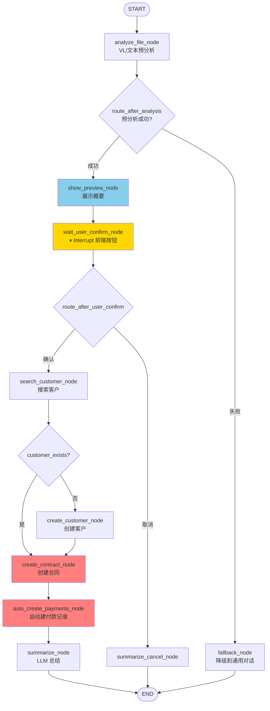
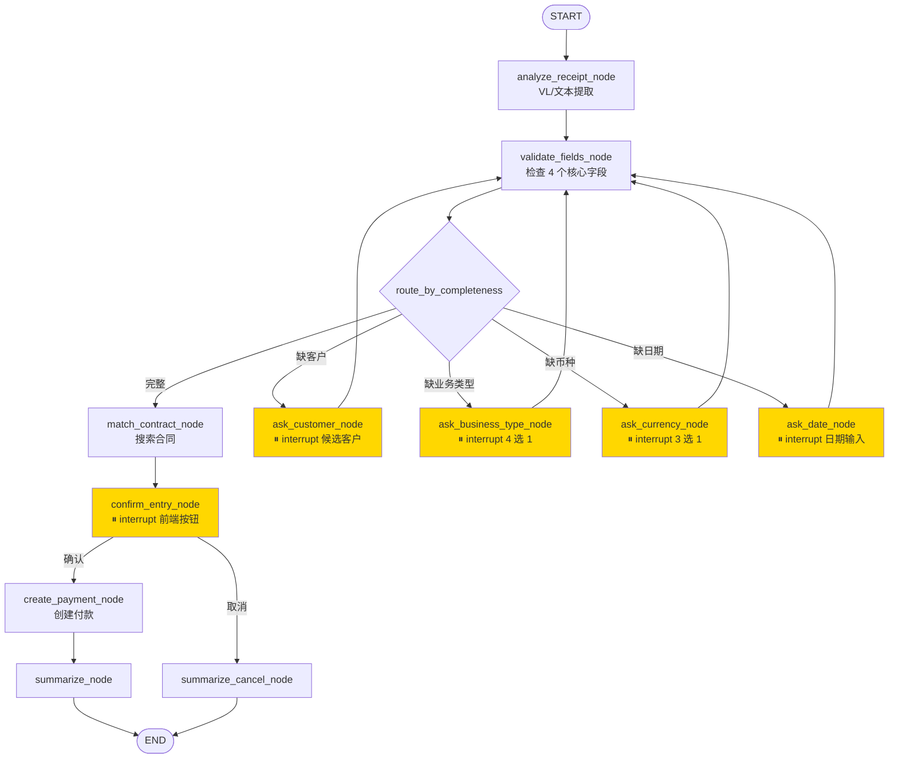
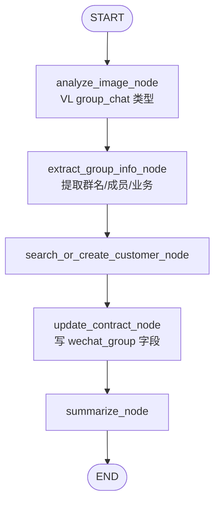
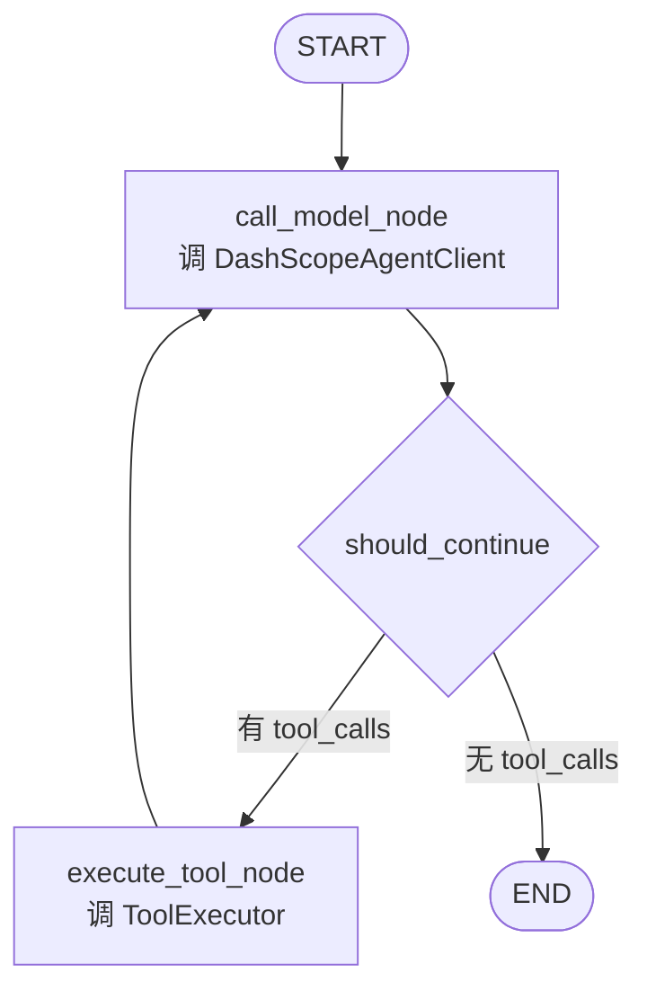
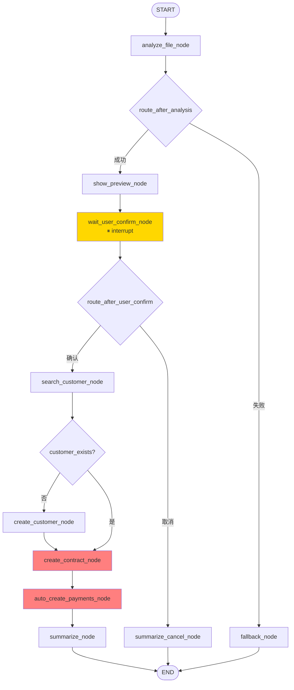
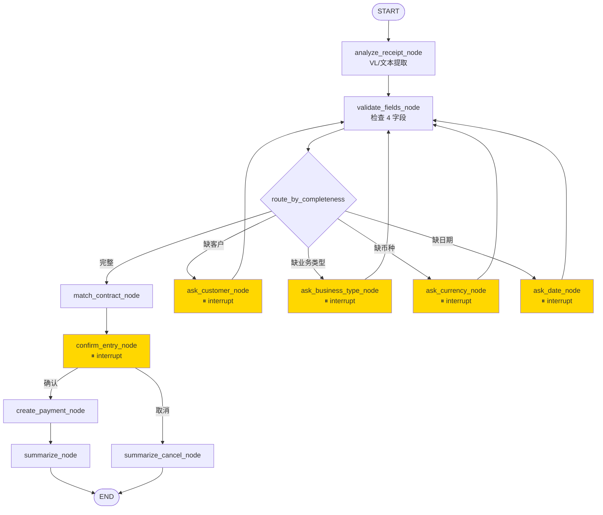
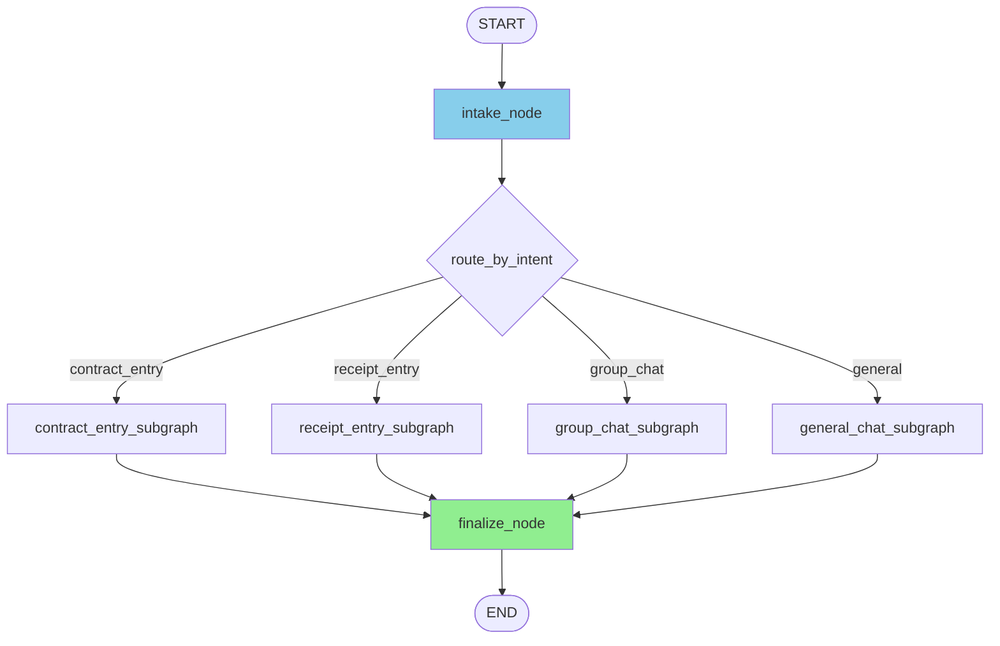

# 智能客服 Agent 编排层升级：LangGraph 状态机方案设计文档

> **文档版本**：v2.1
> **编写日期**：2026-06-06
> **修订日期**：2026-06-06
> **状态**：v2.1 — 基于主分支代码校准，Phase 1.1 已完成
> **目标读者**：后端架构师、AI Agent 工程师、前端架构师、QA
> **关联系统**：华星资源合同管理与智能客服系统（huaxingsasss）
> **关键模块**：`backend/app/ai/agent.py`（主调度）、`backend/app/ai/tools.py`（工具执行器）、`backend/app/ai/prompts.py`（提示词）、`backend/app/ai/llm_client.py`（LLM 客户端）、`frontend/src/store/useAgentStore.ts`（SSE 解析）、`frontend/src/pages/AgentChat.tsx`（聊天 UI）

> **v2.1**（2026-06-06）— 基于主分支代码逐行校准。Phase 1.1 基础设施（checkpointer + psycopg3）已完成。
> 此前主要决策：LangGraph 1.2.4、DashScopeAgentClient 继续使用、PostgresSaver 一步到位、凭证录入子图 Phase 2 降级实现。
> **v2.2**（2026-06-06）— 混合币种处理校准。CNY 合同统一维护 `_in_cny` 字段（1:1 映射）；`get_payment_summary()` 汇总改用 `paid_amount_in_cny` 避免混币种直接求和；`_payment_to_dict_lite()` 新增 `paid_amount_in_cny` 字段供 LLM 自行参考。合同创建/付款/统计三个 service 层均已覆盖，与本文档子图设计无冲突。

---

## 目录

1. [执行摘要](#1-执行摘要)
2. [背景与现状](#2-背景与现状)
3. [根因分析](#3-根因分析)
4. [技术选型](#4-技术选型)
5. [目标与边界](#5-目标与边界)
6. [架构设计](#6-架构设计)
7. [子图拆分](#7-子图拆分)
8. [集成方案](#8-集成方案)
9. [实施计划](#9-实施计划)
10. [测试与验证](#10-测试与验证)
11. [风险与缓解](#11-风险与缓解)
12. [附录](#12-附录)

---

## 1. 执行摘要

### 1.1 一句话结论

将当前 `agent.py` 中"手写 ReAct 循环"重构为 **LangGraph 显式状态机**，通过**节点 + 条件边 + 状态对象 + 检查点**四件套，把"用户已答需要 → 立即执行工具"这类**确定性路由**从 prompt 提升到代码层，从根本上消除"LLM 自由发挥导致重复询问"的 bug，并为后续多场景扩展（凭证录入、群聊关联、多 Agent 协作）提供统一编排底座。

### 1.2 关键收益

| 维度 | 现状 | 升级后 | 改善幅度 |
|------|------|--------|----------|
| 重复询问率 | 已大幅改善（确认正则链已移除） | 0%（确定性子图强制路由；通用对话子图仍依赖 LLM） | 彻底消除（仅限确定性子图） |
| LLM 调用次数（合同录入） | 4-5 次 | 2 次（预分析 + 总结） | 60% ↓ |
| Token 消耗 | 高（每次重读历史） | 低（增量 messages） | 50% ↓ |
| 新流程接入成本 | 改 prompt + 改循环 | 新建子图 + 注册 | 模块化 |
| 状态可观测性 | 弱（日志推断） | 强（LangSmith 全链路） | 质变 |
| Human-in-the-Loop | 无 | 节点级 interrupt | 工业级 |

### 1.3 工作量

- **Phase 1**（合同录入子图 + 前端 interrupt UI + PostgresSaver）：8-10 人天
- **Phase 2**（凭证引导 + 群聊/通用子图 + LangSmith 监控）：7-9 人天
- **Phase 3**（性能调优 + 文档 + 全量上线）：2-3 人天
- **总工期**：17-22 人天（约 3 周半，1 人全职）

### 1.4 不做什么

- 不更换 LLM 供应商（继续 DashScope + SiliconFlow）
- 不变更后端 SSE 端点路径或请求格式（`/api/v1/agent/chat`），但需新增 `interrupt` 事件类型和 `ChatRequest.resume` 字段（详见 §6.6）
- 不重写现有 20 个工具（保持 `tools.py` 兼容）
- 不引入 LangGraph Platform（自建部署，直接用 PostgresSaver）
- **不引入 `langchain-openai` / `ChatOpenAI`**（ADR #2：继续用现有 `DashScopeAgentClient`）
- **不引入 LangGraph 预构建 agent**（ADR #3：`create_react_agent` 已废弃，`create_agent` 绑定 langchain 生态；通用对话子图自建 StateGraph）

### 1.5 架构决策记录 (ADR)

v2.0 修订阶段共确认 7 项架构决策，每项决策基于明确的调研依据和替代方案否决理由：

| # | 决策 | 调研依据 | 否决的替代方案 |
|---|------|----------|----------------|
| **#1** | **interrupt 前端感知** — 前端识别 `interrupt` SSE 事件，用户点击按钮确认（`Command(resume=...)`） | LangGraph `interrupt()` 原生支持；用户打字"需要"易被 LLM 误判；按钮 UI 不可被 LLM 自由发挥影响 | ①前端无感（后端消化 interrupt）：保留 NLP 识别错误风险；②完全跳过 interrupt：靠 prompt 规则约束，治标不治本 |
| **#2** | **LLM 调用继续用 `DashScopeAgentClient`** — 不引入 `langchain-openai` / `ChatOpenAI` | 阿里云百炼 DashScope 兼容模式 `tools` 与 `stream=True` **不能同时使用**（官方文档明确限制）；SiliconFlow 已验证支持流式 function calling；现有客户端含限流重试、SSE 增量解析等定制逻辑 | ①ChatOpenAI + base_url：LangChain 官方有兼容性警告，且无法切换到百炼；②迁移到 OpenAI 官方 API：增加供应商锁定，不符合多 LLM 策略 |
| **#3** | **通用对话子图自建 StateGraph** — 不依赖 `create_react_agent` 预构建 agent | LangGraph 1.2.4 中 `create_react_agent` 已 deprecated；替代 `langchain.agents.create_agent` 绑定 langchain 生态 | ①`create_react_agent`：已废弃；②`create_agent`：绑定 langchain，未来扩展示工具需适配 `@tool` 装饰器；③完全不用 LangGraph 编排：失去状态机价值 |
| **#4** | **凭证录入子图纳入 Phase 2** — 智能追问 + interrupt 确认 | 用户在 Agent 对话中上传凭证时，输入框**必填**辅助文字；凭证无客户/合同信息时需主动追问核心信息（客户、业务类型、币种、日期） | ①不做凭证子图：对话中无法录入凭证，体验断裂；②简单关联 + 错误提示：不满足多轮信息收集需求 |
| **#5** | **Checkpointer 直接用 `AsyncPostgresSaver`** — Phase 1 即生产配置 | 项目已使用 PostgreSQL（生产配置见 `.env:POSTGRES_SERVER=207.57.128.6`，`POSTGRES_DB=contract_db`；`config.py:24` 默认值是 `localhost`），无新增 DB 依赖；测试数据可丢 | ①InMemorySaver：进程重启丢状态；②SqliteSaver：引入额外 DB 依赖；③三阶段演进：增加迁移成本 |
| **#6** | **`chat_history` 表并行保留** — 不被 checkpoint 替代 | checkpoint 存 State 快照（机器可读，用于 interrupt 恢复）；`chat_history` 存人类可读消息（用于前端展示）。两表职责不同，前端 `/history/{session_id}` API 仍依赖 `chat_history` | ①用 checkpoint 替代：需改前端历史接口，破坏现有调试体验；②删 chat_history：丢失按会话/角色查询能力 |
| **#7** | **凭证交互智能追问 4 个核心字段** — 客户、业务类型、币种、日期 | 用户明确"既没有输入辅助性的文字 + 凭证信息不完整"是核心痛点；按客户关联合同（一个客户最多 2-3 个合同），不需要精确定位合同 | ①只问合同：太精确，命中率低；②全部让用户输入：体验差；③不做追问：直接报错，用户需重新上传 |

**调研支持的来源**：

- LangGraph 1.2.4 版本状态：PyPI、GitHub Releases
- `create_react_agent` 废弃：[LangGraph v1 Migration Guide](https://docs.langchain.com/oss/python/migrate/langgraph-v1)
- `astream_events` v2：[LangChain Reference - stream](https://reference.langchain.com/python/langgraph/stream)
- DashScope tools+stream 限制：[DashScope OpenAI 兼容文档](https://help.aliyun.com/zh/model-studio/compatibility-of-openai-with-dashscope)
- SiliconFlow DeepSeek-V4-Flash Tools 支持：[SiliconFlow 模型中心](https://www.siliconflow.com/zh/models/deepseek-v4-flash)
- LangChain ChatOpenAI 非 OpenAI provider 警告：[LangChain Reference - ChatOpenAI](https://reference.langchain.com/python/langchain-openai/chat_models/base/ChatOpenAI)

---

## 2. 背景与现状

### 2.1 业务背景

华星资源是面向中港两地车牌指标过户服务的企业。系统由 3 个角色组成（admin / income / expense），核心流程：

- **合同录入**：上传合同 PDF/Word/Excel → AI 视觉模型（VL）解析 → 自动建客户 + 合同 + 付款记录
- **凭证录入**：上传转账截图 → 关联合同 + 自动入账
- **收付管理**：按币种分组展示收入/支出 KPI
- **智能问答**：ReAct 循环驱动的对话 Agent，支持 20 个工具

技术栈：FastAPI + SQLAlchemy + Pydantic v2 + Celery + Redis + React/TypeScript + Ant Design。

### 2.2 当前 Agent 架构概览

```
前端 (React)
  ↓ POST /api/v1/agent/chat (SSE)
FastAPI (app/api/v1/agent.py)
  ↓
ContractAgent (app/ai/agent.py, 48KB)
  ├─ _process_attachments()        # 附件预分析
  │   ├─ _prepare_file()            # 读取 PDF/Word/Excel 文本
  │   ├─ _analyze_text_content()    # LLM 文本模型（PDF 走这）
  │   └─ _pre_analyze_image()       # VL 模型（图片走这）
  ├─ _load_history()                # 从 chat_history 加载
  ├─ _build_messages()              # 拼装 LLM messages
  ├─ ReAct 循环（手动实现）
  │   ├─ LLM 调用（DashScope Agent / SiliconFlow）
  │   ├─ 解析 tool_calls
  │   ├─ ToolExecutor.execute()     # 20 个工具
  │   └─ SSE 推送 chunk
  └─ _save_message()                # 落库 chat_history
```

**关键文件**：
- `agent.py` (~1168 行)：主调度 + ReAct 循环（`chat()` 方法内 `for iteration in range(settings.AGENT_MAX_ITERATIONS)` 循环是核心）
- `tools.py` (~2897 行)：20 个工具 + `TOOL_DEFINITIONS`（OpenAI 兼容 function calling 格式）
- `prompts.py` (~317 行)：系统提示词 + 业务规则

### 2.3 遗留问题（王振为合同案例，2026-06-06）

用户 `test` 上传 `王振为_買車合同.pdf`，Agent 在 Turn 1 展示合同概要并询问是否录入，用户答"需要的"，但 Turn 2 Agent **又重复展示概要并再问一次**。直到 Turn 3 才真正执行 create_customer → create_contract。总耗时 73 秒，4 次 LLM 调用，用户被迫答 2 次"需要"。

**当前缓解**：正则确认链（`_is_confirmation`）已在 AGENT_AUDIT 中移除，prompt 规则已收紧。但真正的根治需要状态机层的确定路由（§6-§7），确保"用户确认 → 直接执行"不依赖 LLM 自由发挥。

### 2.4 问题影响

| 影响维度 | 量化数据 |
|----------|----------|
| 每次合同录入多余 LLM 调用 | 2 次（Turn 1 + Turn 2 都问"是否需要"） |
| 每次合同录入多余耗时 | ~30-50 秒（用户被迫答两次 + 多一次 LLM 思考） |
| Token 浪费 | 每次约 1500-3000 tokens（Turn 2 重复展示概要） |
| 用户体验 | "我答了需要为啥又问？"——直接降低产品信任度 |
| 业务扩展成本 | 每加一个 HITL 场景（凭证确认、群聊确认），都要改 prompt + 改循环 |

---

## 3. 根因分析

详细根因分析见 [`AGENT_AUDIT.md`](../AGENT_AUDIT.md)（15 个问题，10 个已解决/4 个已改善/1 个已重构）。

**核心结论**：ReAct 循环中 LLM 每次从历史消息"推测"当前阶段，无法保证确定性行为。唯一根治方案是将路由从 prompt 层提升到代码层（LangGraph 节点 + 条件边），让"用户确认 → 执行工具"成为结构化的强制路径。

---

## 4. 技术选型

### 4.1 候选方案对比

| 维度 | 方案 A：纯 prompt 工程 | 方案 B：自研轻量状态机 | 方案 C：LangGraph 1.2.4 | 方案 D：Claude Agent SDK / AutoGen |
|------|------------------------|------------------------|------------------------|-----------------------------------|
| 重复询问率 | ~30%（治标） | ~5%（兜底） | **0%**（确定性子图强制路由；通用对话子图仍依赖 LLM） | 0% |
| 改动量 | 1 文件，30 行 | 1 文件，150 行 | 5-7 文件，500 行 | 5-7 文件，500 行 |
| 学习成本 | 0 | 0 | 中（要学图模型） | 高（要学新范式） |
| 多 Agent 支持 | 无 | 弱 | 强 | 强 |
| HITL 支持 | 无 | 中（手写 interrupt） | 强（原生 interrupt + Command(resume=)） | 强 |
| 检查点/持久化 | 无 | 需自建 | **原生 PostgresSaver** | 原生 |
| 社区生态 | N/A | N/A | 活跃（2026 年 1.x 稳定版） | 活跃 |
| 长期可扩展 | 低 | 中 | **高** | 高 |
| LLM 供应商中立 | 是 | 是 | **是**（不绑定 ChatOpenAI） | 否（绑定 Claude） |
| 与 OpenAI 工具兼容 | N/A | N/A | **完全兼容**（通过 `TOOL_DEFINITIONS` 复用） | 部分兼容（仅 Claude） |

### 4.2 为什么选 LangGraph

1. **彻底解决重复询问**：节点 + 条件边强制路由，LLM 自由发挥被"关进笼子"
2. **OpenAI 工具协议完全兼容**：你的 `TOOL_DEFINITIONS`（tools.py 末段）可以原样复用，零迁移成本
3. **HITL 原生支持**：`interrupt_before` / `interrupt()` / `Command(resume=)` 三件套天然适配"等用户确认"
4. **检查点开箱即用**：直接用 `AsyncPostgresSaver` 复用现有 PostgreSQL，无新增 DB 依赖
5. **流式输出原生支持**：`astream_events(version="v2")` 与现有 FastAPI SSE 对接简单
6. **可观测性强**：LangSmith 自动追踪每个节点的输入/输出/耗时/Token
7. **生态成熟**：2026 年 1.2.x 稳定版（2025-10 发布 1.0 GA，2026-06 最新 1.2.4），API 已稳定，文档/示例/Stack Overflow 答案充足
8. **LLM 无供应商锁定**：继续用现有 `DashScopeAgentClient`（`llm_client.py:191-474`，httpx + SiliconFlow），不需要 ChatOpenAI 包装器（详见 ADR #2）
9. **不影响业务切换**：未来想换 Anthropic SDK 或自建编排层，LangGraph 子图可以平滑迁移

### 4.3 不选 Claude Agent SDK 的原因

- 绑定 Claude 模型，无法继续使用你现有的 DashScope/SiliconFlow
- 多供应商策略要求中立协议层

### 4.4 不选"自研轻量状态机"的原因

- 缺少社区维护，长期演进风险
- 检查点、HITL、流式都要自己造轮子
- 当业务复杂到 5+ 子图时，自研状态机维护成本反超 LangGraph 学习成本

---

## 5. 目标与边界

### 5.1 业务目标

| 目标 | 量化指标 | 验收方法 |
|------|----------|----------|
| **消除重复询问** | 合同录入流程中"需要录入吗"类问句 ≤ 1 次（前端确认按钮，无自由文本确认） | E2E 测试 + 日志审计 |
| **降低端到端耗时** | 合同录入从 ~73s 降到 ≤ 20s | 压测 |
| **降低 Token 消耗** | 合同录入 LLM 调用 ≤ 2 次 | LangSmith 监控 |
| **统一编排层** | 所有 ReAct 流程走同一套图模型 | 代码 Review |
| **支持 HITL** | 高风险操作（创建合同/付款/支出）支持 interrupt + 前端按钮确认 + Command(resume=) | E2E 测试 |
| **支持检查点** | 进程重启后可恢复中断的会话 | 故障演练 |
| **可观测性** | 每个节点的输入/输出/耗时可追溯 | LangSmith UI |
| **凭证录入智能化** | 凭证信息缺失时主动追问客户/业务类型/币种/日期，interrupt 确认后录入 | E2E 测试 |

### 5.2 非目标

- 不替换 LLM 供应商（DashScope + SiliconFlow 继续）
- 不变更后端 SSE 端点路径或请求体字段名（`/api/v1/agent/chat`），但**需新增** `interrupt` SSE 事件类型和 `ChatRequest.resume` 字段（详见 §6.6）
- 不重写 20 个现有工具（保持兼容，必要时做适配层）
- 不引入 LangGraph Platform（自建部署，直接用 PostgresSaver）
- 不优化 LLM prompt 内容（仅调整结构，业务规则不变）
- **不引入 `langchain-openai` / `ChatOpenAI`**（ADR #2）
- **不引入 LangGraph 预构建 agent**（ADR #3）

### 5.3 验收标准

**Phase 1 验收**（合同录入子图 + 前端 interrupt UI 上线）：
- [ ] 王振为合同案例：用户只点 1 次"确认"按钮，无自由文本确认
- [ ] 合同录入总耗时 ≤ 20s
- [ ] LLM 调用次数 = 2（预分析 + 总结）
- [ ] 单测覆盖率 ≥ 80%
- [ ] E2E 测试覆盖 5 个典型场景（普通合同 / 群聊截图 / 重复文件 / 凭证 / 异常输入）
- [ ] 故障演练：通过（注入故障后能从 checkpoint 恢复）
- [ ] **前端 interrupt UI 显示确认/取消按钮**（非文本输入框）
- [ ] **ChatRequest 新增 `resume` / `interrupt_id` 字段并通过验证**
- [ ] **PostgresSaver 在 Phase 1 即配置完成**（非 Phase 3 迁移）

**Phase 2 验收**（全流程子图化 + LangSmith 监控）：
- [ ] 凭证录入（智能追问 + interrupt）、群聊关联、合同查询、付款查询 4 个子图全部上线
- [ ] 通用对话子图自建 StateGraph 替换手写 ReAct，20 个工具全部走 `ToolExecutor.execute()`
- [ ] 所有 ReAct 流程统一走图模型
- [ ] LangSmith 监控接入
- [ ] **凭证录入：附件上传时输入框必填验证生效**

**Phase 3 验收**（生产化）：
- [ ] PostgresSaver 性能验证（已在 Phase 1 配置，Phase 3 验证稳定性）
- [ ] P99 延迟 ≤ 当前水平（不变慢）
- [ ] 月度 LLM 成本下降 ≥ 30%

---

## 6. 架构设计

### 6.1 整体架构对比

**当前（手写 ReAct）**：
```
┌─────────────────────────────────────┐
│ ContractAgent (agent.py:141-275)    │
│                                     │
│  while iter < max_iter:             │
│    ┌─────────────────────────────┐  │
│    │ 1. 构造 messages            │  │
│    │ 2. 调 LLM                   │  │
│    │ 3. 解析 tool_calls?         │  │
│    │    ├─ Yes → 调工具 → 继续   │  │
│    │    └─ No  → 输出文本 → END  │  │
│    └─────────────────────────────┘  │
│                                     │
│  状态：散落在 messages + 局部变量   │
│  路由：LLM 自由决策                  │
│  持久化：每次 chat_history 全量写    │
└─────────────────────────────────────┘
```

**目标（LangGraph 1.2.4 状态机）**：
```
┌─────────────────────────────────────────────────────┐
│ Root Graph (orchestrator_graph)                     │
│                                                     │
│  START → intake_node → route_by_intent              │
│                              ├→ contract_entry_subgraph
│                              ├→ receipt_entry_subgraph
│                              ├→ group_chat_subgraph
│                              └→ general_chat_subgraph
│                                                     │
│  状态：StateGraph TypedDict（强类型）                │
│  路由：add_conditional_edges（代码硬约束）            │
│  持久化：Checkpointer（AsyncPostgresSaver）          │
│  HITL：interrupt() + 前端按钮 + Command(resume=)   │
│  LLM：DashScopeAgentClient（不引入 ChatOpenAI）      │
└─────────────────────────────────────────────────────┘
```

### 6.2 核心状态对象

**RootState（顶层图状态）**：
```python
from typing import TypedDict, Annotated, Optional
from langgraph.graph.message import add_messages
import operator

class RootState(TypedDict):
    # 消息流（LangGraph 内置 add_messages 归约器）
    messages: Annotated[list, add_messages]

    # 用户与上下文
    user_id: int
    user_role: str              # admin / income / expense
    session_id: str

    # 当前任务
    intent: Optional[str]       # contract_entry / receipt_entry / group_chat / general
    attachments: list[dict]     # file_id, file_type
    file_context: Optional[str] # VL/文本预分析结果

    # HITL 中断载荷（由 interrupt() 填充，由 SSE 推送给前端）
    interrupt_info: Optional[dict]  # {type, message, options, interrupt_id}

    # 工具调用历史
    tools_invoked: Annotated[list[str], operator.add]
    pending_tool_calls: list[dict]  # 待执行的 tool_call

    # 错误与降级
    errors: Annotated[list[str], operator.add]
    fallback_strategy: Optional[str]  # 当 LLM 出错时的兜底

    # 流程控制
    current_node: str
    iteration_count: int
    should_end: bool

    # chat_history 并行落库标记（ADR #6）
    chat_history_meta: dict

    # ⚠️ ToolExecutor 上下文（**必须**在 root graph 启动时填进 initial_state，
    #    否则子图节点拿不到，mode guard 会直接拦截 create_payment/create_expense）
    # 注入点：graph.astream(initial_state) 前，参考 agent.py chat() 方法中
    #    self.executor.mode = self._mode 等赋值逻辑
    executor_mode: str          # "chat" | "receipt_income" | "receipt_expense"（来自 session 元数据）
    session_context: dict       # 会话上下文（前端 page 状态等），透传给 ToolExecutor 供 DB 兜底查询
```

**ToolExecutor 上下文注入规则（关键，缺失会导致 mode guard 静默拦截）：**

1. **入口处**（LangGraph root graph `astream(initial_state)` 调用前）：
   ```python
   # 复用现有 ContractAgent.chat() 入口的注入逻辑（agent.py chat() 方法开头）
   agent._load_session_meta(session_id)        # 加载 mode + context
   initial_state = {
       **state_template,
       "executor_mode": agent._mode,           # "chat" / "receipt_income" / "receipt_expense"
       "session_context": agent._session_context or {},
       "session_id": session_id,               # 复用 RootState 已有字段
       # ... 其他字段
   }
   ```

2. **节点内**（所有需要调 executor 的节点）：
   ```python
   async def some_node(state: RootState, agent) -> dict:
       # 把 state 里的字段同步到 executor
       agent.executor.mode = state["executor_mode"]
       agent.executor.session_context = state.get("session_context")
       agent.executor.session_id = state["session_id"]   # 复用 RootState 字段
       # 业务逻辑...
   ```

3. **替代方案**：在 graph 编译时通过 closure 注入 executor 实例（更彻底但更难调试，Phase 1 推荐 state 注入方案）。

**ContractEntryState（合同录入子图状态，继承 RootState）**：
```python
class ContractEntryState(RootState):
    # 合同特有字段
    contract_data: Optional[dict]   # VL/文本预分析的结构化数据
    customer_id: Optional[int]
    customer_name: Optional[str]
    customer_exists: bool          # search_customers 是否找到

    # HITL 子图特有字段（从 RootState 移入）
    preview_shown: bool            # 是否已展示过概要
    user_confirmed: bool           # 用户是否已点击"确认录入"按钮

    # 自动付款
    auto_payments: list[dict]      # 自动创建的付款记录
```

**ReceiptEntryState（凭证录入子图状态）**：
```python
class ReceiptEntryState(RootState):
    # 凭证特有字段（ADR #4 + #7）
    receipt_data: Optional[dict]       # VL/文本提取的结构化数据
    matched_contract_id: Optional[int]  # 智能追问后确定的合同
    matched_customer_id: Optional[int]
    matched_customer_name: Optional[str]
    matched_business_type: Optional[str]  # 车辆买卖/两地牌过户/年检保险/其他
    matched_currency: Optional[str]     # CNY/HKD（业务只用CNY/HKD，USD为预留）
    matched_date: Optional[str]         # YYYY-MM-DD
    missing_fields: list[str]           # ["customer", "business_type", "currency", "date"] 中缺失项
    amount: Optional[float]
    payment_type: str                   # "income" | "expense"
```

**GroupChatState（群聊关联子图状态）**：
```python
class GroupChatState(RootState):
    # 群聊特有字段
    group_info: Optional[dict]          # 群名、成员列表、业务类型推断
    matched_contract_id: Optional[int]  # 关联到的合同
    matched_customer_id: Optional[int]
```

**GeneralChatState（通用对话子图状态）**：
```python
class GeneralChatState(RootState):
    # 通用对话无新增字段，复用 RootState 即可
    # （保留独立类是为了未来扩展，如多轮澄清字段、上下文引用等）
    pass
```

**⚠️ State 体系统一规则（避免出现两套 state 体系）：**

- **所有子图状态类必须继承 `RootState`**，不复用 LangGraph 内置 `MessagesState`
- LangGraph 内置 `MessagesState` 只在「不涉及子图外的字段」时使用，且仅限局部辅助 state，不作为子图 state 的基类
- `messages` 字段统一用 `Annotated[list, add_messages]` 归约器（见 RootState 定义）
- 子图与 Root Graph 之间的 state 转换：LangGraph 在子图入口/出口自动按字段名映射（同名字段直传，新增字段隔离）
- 实施校验：grep `StateGraph(MessagesState)` 应**只有 0 处**（除文档外）

反例（不要这么写）：
```python
# ❌ 错误：混用两套 state 体系
general_chat_graph = StateGraph(MessagesState)  # 缺 executor_mode / session_id / intent 等 RootState 字段
```

### 6.3 节点定义

#### 6.3.1 节点清单（Root Graph）

| 节点名 | 职责 | 输入 | 输出 |
|--------|------|------|------|
| `intake_node` | 入口：解析 attachments，决定走哪个子图 | RootState（initial） | RootState（intent + file_context） |
| `route_by_intent` | 路由：根据 intent 选子图 | RootState | Command（goto 子图） |
| `contract_entry_subgraph` | 合同录入子图（见 7.1） | ContractEntryState | ContractEntryState |
| `receipt_entry_subgraph` | 凭证录入子图（见 7.2） | ReceiptEntryState | ReceiptEntryState |
| `group_chat_subgraph` | 群聊关联子图（见 7.3） | GroupChatState | GroupChatState |
| `general_chat_subgraph` | 通用对话子图（见 7.4） | GeneralChatState | GeneralChatState |
| `finalize_node` | 出口：chat_history 落库 + SSE 推送 done 事件 | RootState | END |

#### 6.3.2 节点实现示例（intake_node）

```python
async def intake_node(state: RootState, agent: "ContractAgent") -> dict:
    """入口节点：处理 attachments，决定意图
    复用现有 ContractAgent._prepare_file / _analyze_text_content / _pre_analyze_image
    """
    attachments = state.get("attachments", [])
    if not attachments:
        return {"intent": "general", "file_context": None}

    # 走现有的附件预分析逻辑（agent.py:358-549，覆盖 _prepare_file / _analyze_text_content / _pre_analyze_image）
    file_id = attachments[0]["file_id"]
    file_type = attachments[0].get("file_type", "")
    prep = await agent._prepare_file(file_id, file_type)

    if prep and prep.get("text"):
        # 走文本预分析（PDF/Word/Excel）
        result = await agent._analyze_text_content(file_id, prep["file_type_label"], prep["text"])
        intent = _infer_intent_from_context(result, state["messages"][-1].content if state["messages"] else "")
    elif prep is None:
        # 走 VL 预分析（图片）
        result = await agent._pre_analyze_image(file_id)
        intent = _infer_intent_from_context(result, state["messages"][-1].content if state["messages"] else "")
    else:
        # 重复文件 / 失败 → 走通用流程
        result = None
        intent = "general"

    return {
        "intent": intent,
        "file_context": result,
        "current_node": "intake_node",
        "iteration_count": state.get("iteration_count", 0) + 1,
    }

def _infer_intent_from_context(file_context: Optional[str], user_msg: str) -> str:
    """根据文件类型 + 用户消息推断意图"""
    if not file_context:
        return "general"

    # 复用 prompts.py 的业务类型判断
    if "contract" in file_context.lower() or "合同" in user_msg:
        return "contract_entry"
    if "receipt" in file_context.lower() or "凭证" in user_msg or "转账" in user_msg:
        return "receipt_entry"
    if "group" in file_context.lower() or "群" in user_msg:
        return "group_chat"
    return "general"
```

#### 6.3.3 finalize_node 设计（ADR #6）

```python
async def finalize_node(state: RootState, db: Session) -> dict:
    """结束节点：chat_history 落库 + 清理 interrupt_info
    注意：checkpoint 已由 checkpointer 自动处理，finalize_node 不重复写。
    """
    from app.ai.agent import ContractAgent  # 仅用于复用 _save_message 逻辑

    # 复用现有 _save_message 写入 chat_history（与原行为完全一致）
    agent_helper = ContractAgent(db, current_user=...)
    for msg in state["messages"]:
        if msg.type == "ai":
            agent_helper._save_message(
                state["session_id"],
                "assistant",
                msg.content,
                tool_calls=getattr(msg, "tool_calls", None),
            )
        elif msg.type == "human":
            agent_helper._save_message(state["session_id"], "user", msg.content)
        elif msg.type == "tool":
            agent_helper.save_tool_message(state["session_id"], msg)

    return {
        "should_end": True,
        "interrupt_info": None,  # 清理
    }
```

### 6.4 边定义

#### 6.4.1 条件边（Conditional Edges）

```python
def route_by_intent(state: RootState) -> Literal[
    "contract_entry_subgraph",
    "receipt_entry_subgraph",
    "group_chat_subgraph",
    "general_chat_subgraph",
]:
    """根据 intent 路由到对应子图

    ⚠️ 必须同时检查 mode，否则会出现"路由到 receipt_entry_subgraph 但
       executor.mode='chat' → mode guard 拦截 create_payment/create_expense"的
       静默失败（参考报告 C1）。
    """
    intent = state.get("intent", "general")
    mode = state.get("executor_mode", "chat")

    # mode × intent 路由矩阵（缺一不可）：
    #
    #   intent ↓ \ mode → | chat              | receipt_income / receipt_expense
    #   ------------------+-------------------+----------------------------------
    #   contract_entry    | contract_entry_.. | general_chat_subgraph（降级引导）
    #   receipt_entry     | general_chat_..   | receipt_entry_subgraph
    #   group_chat        | group_chat_..     | general_chat_subgraph（降级引导）
    #   general           | general_chat_..   | general_chat_subgraph
    #
    # 降级时由 general_chat_subgraph 设置 interrupt_info 提示用户切换入口
    # （如凭证录入已迁移到合同卡片按钮，见 ADR #4 + §7.2）。

    if intent == "receipt_entry" and mode == "chat":
        # chat 模式 + 凭证意图 → 不进 receipt_entry_subgraph，避免 mode guard 拦截
        # 由 general_chat_subgraph 引导用户到合同列表卡片的「收」「支」按钮
        return "general_chat_subgraph"

    if intent in ("contract_entry", "group_chat") and mode in ("receipt_income", "receipt_expense"):
        # 凭证专用 session 里误触发合同/群聊意图 → 降级到通用对话
        return "general_chat_subgraph"

    return {
        "contract_entry": "contract_entry_subgraph",
        "receipt_entry": "receipt_entry_subgraph",
        "group_chat": "group_chat_subgraph",
        "general": "general_chat_subgraph",
    }.get(intent, "general_chat_subgraph")
```

**⚠️ 节点函数签名说明（重要，避免实施时编译失败）：**

LangGraph 1.2.4 节点函数只能拿到 `state` 和 `config: RunnableConfig` 两个位置参数。`db` / `current_user` / `executor` 等依赖**不能作为节点函数的位置参数**，必须通过以下两种方式之一注入：

- **方式 A：closure 注入**（推荐，调试友好）
  ```python
  def make_executor_node(db, current_user):
      async def execute_tool_node(state: GeneralChatState, config: RunnableConfig):
          executor = ToolExecutor(db, current_user)
          executor.mode = state["executor_mode"]  # 同步 state 字段
          # ...
      return execute_tool_node

  contract_entry_graph.add_node(
      "execute_tool_node",
      make_executor_node(db, current_user),
  )
  ```

- **方式 B：InjectedState 注入**（更声明式，但要求 state 包含所需字段）

本节示例为简洁起见，**用 `(state, db, current_user)` 签名示意**，实施时按方式 A 改造为 closure 形式。

#### 6.4.2 静态边

```python
workflow.add_edge(START, "intake_node")
workflow.add_edge("intake_node", "route_by_intent")
# route_by_intent 是条件边，不需要 add_edge
# 4 个子图都汇聚到 finalize_node
workflow.add_edge("contract_entry_subgraph", "finalize_node")
workflow.add_edge("receipt_entry_subgraph", "finalize_node")
workflow.add_edge("group_chat_subgraph", "finalize_node")
workflow.add_edge("general_chat_subgraph", "finalize_node")
workflow.add_edge("finalize_node", END)
```

**⚠️ 子图作为节点接入 root graph 的注意事项：**

LangGraph 1.2.4 中，子图作为节点加入 root graph 时，子图内部的 `END` **不会自动连接到外层图的下一个节点**。需要按以下方式处理：

```python
# 方式 A：把编译后的子图作为节点（subgraph END 输出为 None，root 不知道子图已完成）
workflow.add_node("contract_entry_subgraph", contract_entry_app)

# 方式 B：用 add_conditional_edges 监听子图完成事件（推荐）
# 子图内显式 add_edge("summarize_node", "__end__") 或 return Command(goto=...)
# root 层用 conditional_edges 监听
workflow.add_conditional_edges(
    "contract_entry_subgraph",
    lambda state: "finalize_node",  # 简化版：子图输出后总去 finalize
    {"finalize_node": "finalize_node"},
)
```

实施时优先采用方式 B，否则 root 会在子图完成后无响应。完整子图接入模式参考 LangGraph 官方 "Subgraphs" 文档。

### 6.5 检查点（Checkpoint）

**根据 ADR #5：直接用 `AsyncPostgresSaver` 复用现有 PostgreSQL，Phase 1 即生产配置。**

**为什么不分三阶段（InMemory → Sqlite → Postgres）？**

1. **InMemorySaver**：进程重启即丢状态，开发的真实行为与生产不一致
2. **SqliteSaver**：引入额外 DB 依赖，运维成本上升；项目已使用 PostgreSQL
3. **PostgresSaver 直接用**：复用现有 `DATABASE_URL`（生产配置见 `.env:POSTGRES_SERVER=207.57.128.6`；`config.py:24` 默认值是 `localhost`），无新增依赖，Phase 1 配置后无需迁移

**实现**：
```python
from langgraph.checkpoint.postgres.aio import AsyncPostgresSaver
from app.config import settings

async def create_checkpointer() -> AsyncPostgresSaver:
    """创建 AsyncPostgresSaver，复用现有 PostgreSQL 连接"""
    checkpointer = AsyncPostgresSaver.from_conn_string(settings.DATABASE_URL)
    await checkpointer.setup()  # 首次运行：创建 checkpoint / checkpoint_writes / checkpoint_blobs 表
    return checkpointer

# 在 FastAPI 启动时初始化一次
@app.on_event("startup")
async def init_checkpointer():
    global checkpointer
    checkpointer = await create_checkpointer()
    root_app = root_workflow.compile(checkpointer=checkpointer)
```

**首次运行的数据库变更**（提供 SQL 供手动执行）：

`checkpointer.setup()` 会创建以下 3 张表（均在 `public` schema，与现有 10 张业务表隔离）：

```sql
-- LangGraph checkpoint 表（自动创建，可手动验证）
CREATE TABLE IF NOT EXISTS checkpoints (
    thread_id TEXT NOT NULL,
    checkpoint_ns TEXT NOT NULL DEFAULT '',
    checkpoint_id TEXT NOT NULL,
    parent_checkpoint_id TEXT,
    type TEXT,
    checkpoint JSONB NOT NULL,
    metadata JSONB NOT NULL DEFAULT '{}',
    PRIMARY KEY (thread_id, checkpoint_ns, checkpoint_id)
);

CREATE TABLE IF NOT EXISTS checkpoint_writes (
    thread_id TEXT NOT NULL,
    checkpoint_ns TEXT NOT NULL DEFAULT '',
    checkpoint_id TEXT NOT NULL,
    task_id TEXT NOT NULL,
    idx INTEGER NOT NULL,
    channel TEXT NOT NULL,
    type TEXT,
    blob BYTEA NOT NULL,
    PRIMARY KEY (thread_id, checkpoint_ns, checkpoint_id, task_id, idx)
);

CREATE TABLE IF NOT EXISTS checkpoint_blobs (
    thread_id TEXT NOT NULL,
    checkpoint_ns TEXT NOT NULL DEFAULT '',
    channel TEXT NOT NULL,
    version TEXT NOT NULL,
    type TEXT NOT NULL,
    blob BYTEA,
    PRIMARY KEY (thread_id, checkpoint_ns, channel, version)
);

CREATE INDEX IF NOT EXISTS checkpoints_thread_id_idx ON checkpoints(thread_id);
CREATE INDEX IF NOT EXISTS checkpoint_writes_thread_id_idx ON checkpoint_writes(thread_id);
```

### 6.6 中断与恢复（HITL 核心 — 前端协议）

**根据 ADR #1：interrupt 由前端感知，用户通过点击按钮确认，而非打字"需要"。**

#### 6.6.1 节点内显式 interrupt（本项目唯一采用的方式）

LangGraph 1.2.4 推荐使用节点内 `interrupt()` 而非 `interrupt_before`，因为：
- `interrupt_before` 适合后端管理的固定断点，不易向前端传递结构化信息
- `interrupt()` 可以在节点内返回任意结构化 payload，前端按 schema 渲染

**核心 HITL 节点示例**（合同录入子图）：

```python
from langgraph.types import interrupt, Command

def wait_user_confirm_node(state: ContractEntryState) -> dict:
    """等待用户通过前端按钮确认录入合同

    interrupt() 会暂停执行，payload 通过 SSE 推送给前端。
    前端显示确认/取消按钮，点击后通过 Command(resume=...) 恢复执行。
    """
    preview = {
        "customer_name": state["contract_data"].get("customer_name"),
        "contract_number": state["contract_data"].get("contract_number"),
        "total_amount": state["contract_data"].get("total_amount"),
        "currency": state["contract_data"].get("currency"),
    }
    user_response = interrupt({
        "type": "contract_confirmation",
        "message": f"是否录入客户【{preview['customer_name']}】的合同？\n编号：{preview['contract_number']}\n金额：{preview['total_amount']} {preview['currency']}",
        "preview": preview,
        "options": [
            {"label": "确认录入", "value": {"confirmed": True}},
            {"label": "取消", "value": {"confirmed": False}},
        ],
        "interrupt_id": f"contract_{uuid.uuid4().hex[:8]}",  # 用于前端验证
    })

    return {
        "user_confirmed": user_response.get("confirmed", False),
        "preview_shown": True,
    }
```

**禁止** 用 `try/except` 包裹 `interrupt()`（会捕获其内部异常）。`interrupt()` 之前的副作用必须是幂等的（节点会从头重跑）。

#### 6.6.2 前端 interrupt 协议（ADR #1 关键设计）

**完整事件流**：

```
[1] 用户上传合同文件 + 输入"请录入"
    → POST /api/v1/agent/chat {
        session_id: "abc-123",
        question: "请录入",
        attachments: [{file_id: "f-001", file_type: "pdf"}]
      }

[2] 后端 LangGraph 执行 → analyze_file_node → show_preview_node → wait_user_confirm_node
    → interrupt() 暂停
    → SSE: {"event": "thinking", "data": {"message": "正在分析文件..."}}
    → SSE: {"event": "thinking", "data": {"message": "正在准备确认面板..."}}
    → SSE: {"event": "interrupt", "data": {
        "type": "contract_confirmation",
        "message": "是否录入客户【王振为】的合同？\n编号：HT-2026-001\n金额：260,000 HKD",
        "options": [
          {"label": "确认录入", "value": {"confirmed": true}},
          {"label": "取消", "value": {"confirmed": false}}
        ],
        "interrupt_id": "contract_a1b2c3d4"
      }}
    → SSE: {"event": "done", "data": {"session_id": "abc-123", "interrupted": true}}

[3] 前端收到 interrupt 事件 → 显示确认面板 → 禁用输入框 → 用户点击"确认录入"
    → POST /api/v1/agent/chat {
        session_id: "abc-123",
        question: "",          # 空字符串
        attachments: [],        # 空数组
        resume: {"confirmed": true},
        interrupt_id: "contract_a1b2c3d4"
      }

[4] 后端收到 resume → app.invoke(Command(resume={"confirmed": True}), config=config)
    → wait_user_confirm_node 返回 {"user_confirmed": True}
    → 继续执行 create_customer_node → create_contract_node → auto_create_payments_node → summarize_node
    → SSE 推送各阶段 thinking/text/done 事件

[5] SSE: {"event": "done", "data": {"session_id": "abc-123", "interrupted": false}}
```

#### 6.6.3 ChatRequest Schema 变更

**`backend/app/api/v1/agent.py` 的 `ChatRequest` 需新增 2 个字段**：

```python
from pydantic import BaseModel, Field, model_validator
from typing import Optional, List, Any

class ChatRequest(BaseModel):
    question: str = Field(default="", max_length=5000)
    session_id: Optional[str] = None
    attachments: Optional[List[AttachmentItem]] = None

    # 新增：中断恢复（ADR #1）
    resume: Optional[dict] = Field(
        default=None,
        description="Command(resume=) 载荷，例如 {confirmed: True}。与 question/attachments 互斥。"
    )
    interrupt_id: Optional[str] = Field(
        default=None,
        description="待恢复的 interrupt_id，与 checkpoint 中待处理 interrupt 匹配才能 resume"
    )

    @model_validator(mode="after")
    def check_resume_consistency(self) -> "ChatRequest":
        """Pydantic v2 内联验证：resume 与 question/attachments 互斥
        （替代 v1 风格的独立 validate_resume_consistency 方法 + 手动调用）
        """
        if self.resume is not None:
            if self.question or self.attachments:
                raise ValueError("resume 非空时，question 和 attachments 必须为空")
        if self.resume is None and not self.question and not self.attachments:
            raise ValueError("正常消息必须包含 question 或 attachments 至少一项")
        return self
```

**interrupt_id 验证逻辑**（在 FastAPI endpoint 中，因为要查 checkpoint 比对，无法在 schema 层做）：

```python
@router.post("/chat")
async def chat(request: ChatRequest, current_user = Depends(get_current_user)):
    # Pydantic v2 自动触发 @model_validator，无需手动调 request.validate_resume_consistency()

    if request.resume:
        # 中断恢复：验证 interrupt_id 匹配（必须在 endpoint 层查 checkpoint）
        config = {"configurable": {"thread_id": request.session_id}}
        state_snapshot = await checkpointer.aget(config)
        # LangGraph 1.2.x 标准字段：state_snapshot.interrupts: tuple[Interrupt, ...]
        if request.interrupt_id not in [i.id for i in state_snapshot.interrupts]:
            raise HTTPException(403, "interrupt_id 不匹配当前待处理中断")

    # ... 走 event_generator
```

**为什么 interrupt_id 验证下沉不到 schema？** `checkpointer.aget()` 是异步 I/O 操作（数据库查询），Pydantic validator 只能做同步纯计算，**异步验证需要自定义 validator + asyncio.run 或在 endpoint 显式调用**。本项目采用更干净的方案：resume 互斥（纯逻辑）走 schema，interrupt_id 匹配（I/O）走 endpoint。

> 注：Pydantic 2.5+ 已支持 `async def` 形式的 `@model_validator(mode="after")`，但仍有一些限制（不能直接 await 异步上下文依赖）。本项目为减少耦合，**保持现状**（resume 互斥走 schema，interrupt_id 匹配走 endpoint）。

### 6.7 与现有 20 个工具的集成（ADR #2：不用 ChatOpenAI）

**⚠️ 类名与实现反向（必读，避免新人误解）：**

`llm_client.py` 中两个类的类名和实际调用的 provider 是**反的**，属历史遗留命名：

| 类名 | 文件位置 | 实际使用 | 调用的 API |
|------|----------|----------|------------|
| `SiliconFlowClient` | `llm_client.py` 顶部类 | `DASHSCOPE_API_KEY` + `DASHSCOPE_BASE_URL` + `DASHSCOPE_VISION_MODEL` | **阿里云百炼** qwen3-vl-flash（VL 视觉模型）|
| `DashScopeAgentClient` | `llm_client.py` 下半部分类 | `SILICONFLOW_API_KEY` + `SILICONFLOW_BASE_URL` + `SILICONFLOW_AGENT_MODEL` | **硅基流动** DeepSeek-V4-Flash（Agent 推理）|

**口诀**：类名含 "SiliconFlow" 的实际调百炼；类名含 "DashScope" 的实际调硅基流动。

**为什么不重命名？** 重命名要动 `agent.py` 多处引用 + 所有测试，且无业务收益（类名错误不影响功能）。本项目采纳"保留现状 + 文档说明"方案。

**集成策略**：

**关键洞察**：你的 `TOOL_DEFINITIONS`（tools.py 末段）已经是 OpenAI function calling 格式，但**我们不在 LangGraph 中引入 langchain-openai / ChatOpenAI**（ADR #2）。原因：

1. 阿里云百炼 DashScope 兼容模式 `tools` 与 `stream=True` **不能同时使用**（官方限制）
2. SiliconFlow 已验证支持流式 function calling（项目正在用）
3. LangChain 官方对 `ChatOpenAI` 指向非 OpenAI provider 明确标注兼容性风险

**集成策略**：

- **确定性子图**（合同/凭证/群聊）：节点内**不通过 LLM tool_call**，直接调 `ToolExecutor.execute()`，跳过 LLM 工具调用层
- **通用对话子图**：节点内调 `DashScopeAgentClient.chat_completion_stream()`，手动解析 SSE 中的 `tool_calls` delta

**确定性子图的工具调用**（合同录入子图示例）：

```python
import asyncio
from app.ai.tools import ToolExecutor

async def create_customer_node(state: ContractEntryState, db, current_user) -> dict:
    """直接调 ToolExecutor，不走 LLM tool_call"""
    if state["customer_exists"]:
        return {}  # 客户已存在，跳过

    executor = ToolExecutor(db, current_user)
    result_str = await asyncio.to_thread(
        executor.execute,
        "create_customer",
        {
            "name": state["contract_data"]["customer_name"],
            "phone": state["contract_data"].get("phone"),
            "id_number": state["contract_data"].get("id_card_number"),
        },
    )
    result = json.loads(result_str)

    return {
        "customer_id": result["customer"]["id"],
        "tools_invoked": ["create_customer"],
    }
```

**通用对话子图的 LLM 集成**：

```python
from app.ai.llm_client import DashScopeAgentClient
from app.ai.tools import TOOL_DEFINITIONS, ToolExecutor

llm_client = DashScopeAgentClient()

async def call_model_node(state: GeneralChatState) -> dict:
    """通用对话子图的 LLM 调用节点
    手动解析 SSE 中的 tool_calls，不依赖 ChatOpenAI.bind_tools()
    """
    full_text = ""
    tool_calls = []

    async for event in llm_client.chat_completion_stream(
        messages=state["messages"],
        tools=TOOL_DEFINITIONS,
        temperature=0.3,
    ):
        if event["type"] == "text":
            full_text += event["content"]
        elif event["type"] == "tool_call":
            tool_calls.append({
                "id": event["id"],
                "name": event["name"],
                "arguments": event["arguments"],
            })
        elif event["type"] == "usage":
            state["tokens_used"] = state.get("tokens_used", 0) + event.get("total_tokens", 0)

    if tool_calls:
        return {
            "messages": [{
                "role": "assistant",
                "content": full_text or None,
                "tool_calls": [
                    {
                        "id": tc["id"],
                        "type": "function",
                        "function": {"name": tc["name"], "arguments": tc["arguments"]},
                    }
                    for tc in tool_calls
                ],
            }],
        }
    return {"messages": [{"role": "assistant", "content": full_text}]}


async def execute_tool_node(state: GeneralChatState) -> dict:
    """执行 LLM 决定的工具调用"""
    last_msg = state["messages"][-1]
    if not last_msg.get("tool_calls"):
        return {}

    executor = ToolExecutor(db, current_user)
    tool_messages = []
    for tc in last_msg["tool_calls"]:
        try:
            args = json.loads(tc["function"]["arguments"]) if isinstance(tc["function"]["arguments"], str) else tc["function"]["arguments"]
        except json.JSONDecodeError:
            args = {}

        result = await asyncio.to_thread(executor.execute, tc["function"]["name"], args)
        tool_messages.append({
            "role": "tool",
            "tool_call_id": tc["id"],
            "content": result,
        })

    return {"messages": tool_messages}
```

### 6.8 流式输出（SSE 兼容 — version="v2"）

**LangGraph 1.2.4 流式事件**：

```python
async for event in app.astream_events(initial_state, config, version="v2"):
    kind = event["event"]
    if kind == "on_chain_start":
        node_name = event["name"]
        yield {"event": "thinking", "data": {"message": f"正在执行 {node_name}..."}}
    elif kind == "on_chat_model_stream":
        # LLM 文本流（注意：1.2.x 推荐用 on_chat_model_stream 而非 on_llm_stream）
        chunk = event["data"]["chunk"]
        if chunk.content:
            yield {"event": "text", "data": {"content": chunk.content}}
    elif kind == "on_tool_start":
        tool_name = event["name"]
        yield {"event": "thinking", "data": {"message": f"正在执行 {tool_name}..."}}
    elif kind == "on_tool_end":
        output = event["data"].get("output")
        yield {"event": "tool_result", "data": {"name": event["name"], "result": str(output)}}
    elif kind == "on_chain_end" and event["name"] == "wait_user_confirm_node":
        # 节点内 interrupt() 触发后，节点结束事件携带 interrupt payload
        interrupt_payload = event["data"].get("output", {}).get("interrupt_info")
        if interrupt_payload:
            yield {"event": "interrupt", "data": interrupt_payload}
            yield {"event": "done", "data": {"session_id": ..., "interrupted": True}}
            return
```

**LangGraph 事件 → SSE 事件映射表**：

| LangGraph 事件 (v2) | 映射到 SSE | 说明 | 当前后端状态 |
|---------------------|------------|------|-------------|
| `on_chain_start` | `{"event": "thinking", "data": {"message": ...}}` | 节点开始执行 | ✅ 已实现（`agent.py:258`）|
| `on_chat_model_stream` | `{"event": "text", "data": {"content": ...}}` | LLM 文本流 | ✅ 已实现（`agent.py:166, 197, 213`）|
| `on_tool_start` | `{"event": "tool_call", "data": {"id", "name", "arguments"}}` | LLM 决定调工具（解析 SSE delta）| ✅ 已实现（`agent.py:261`）|
| `on_tool_end` | `{"event": "tool_result", "data": {"name", "result"}}` | 工具执行结果 | ✅ 已实现（`agent.py:287`）|
| `wait_user_confirm_node` 结束 | `{"event": "interrupt", "data": {...}}` | interrupt 触发，**前端按钮确认** | ❌ Phase 1 新增事件（当前后端不发射）|
| interrupt 触发后 | `{"event": "done", "data": {"session_id": ..., "interrupted": true}}` | 标记当前会话被中断 | ❌ Phase 1 新增 `interrupted` 字段（当前 `agent.py:310-313` 只发 `session_id` + `tokens_used`）|
| 图执行结束 | `{"event": "done", "data": {"session_id": ..., "interrupted": false, "tokens_used": ...}}` | 正常完成 | ⚠️ Phase 1 需补 `interrupted` 字段（当前只有 `tokens_used`）|
| 任何异常 | `{"event": "error", "data": {"message": ...}}` | 错误 | ✅ 已实现 |

**⚠️ 与 §6.8 之前版本的差异（v2.1 校准发现）：**

1. **`tool_call` 事件**：从 `on_tool_start` 映射出的是**工具调用**事件（LLM 决定调哪个工具），不是文档原版写的 `thinking`（"工具开始"）。`useAgentStore.ts:206-223` 已处理该事件并把 toolCall 累积到消息列表
2. **`done` 事件的 `interrupted` 字段**：当前后端 `agent.py:310-313` **不发射**该字段。Phase 1 实施时需在 SSE 适配层显式补：
   ```python
   # sse_adapter.py map_langgraph_event_to_sse 中
   if kind == "on_chain_end" and event.get("name") in ("wait_user_confirm_node", ...):
       interrupt_payload = output.get("interrupt_info")
       if interrupt_payload:
           yield {"event": "interrupt", "data": interrupt_payload}
           yield {"event": "done", "data": {"session_id": session_id, "interrupted": True}}
           return
   # 正常完成时
   yield {"event": "done", "data": {"session_id": session_id, "interrupted": False, "tokens_used": ...}}
   ```
3. **`interrupt` 事件**：当前 `useAgentStore.ts:198-270` 的事件分发**不包含**该分支。Phase 1 需新增（详见 §8.1.1）

**与现有 FastAPI SSE 端点对接**：

```python
# app/api/v1/agent.py（保留现有 endpoint，内部重写实现）
@router.post("/chat")
async def chat(request: ChatRequest, current_user = Depends(get_current_user)):
    request.validate_resume_consistency()
    config = {"configurable": {"thread_id": request.session_id}}

    async def event_generator():
        try:
            if request.resume:
                # 中断恢复路径
                result = await root_app.ainvoke(
                    Command(resume=request.resume),
                    config=config,
                )
                # resume 后通常会执行到图结束，简化处理
                yield sse_format({"event": "done", "data": {"session_id": request.session_id, "interrupted": False}})
            else:
                # 正常消息路径
                initial_state = {
                    "messages": [HumanMessage(content=request.question or "")],
                    "user_id": current_user.id,
                    "user_role": current_user.role,
                    "session_id": request.session_id,
                    "attachments": [att.dict() for att in request.attachments or []],
                    "intent": None,
                    "file_context": None,
                    "interrupt_info": None,
                    "tools_invoked": [],
                    "errors": [],
                    "iteration_count": 0,
                    "should_end": False,
                    "chat_history_meta": {},
                }
                async for event in root_app.astream_events(initial_state, config, version="v2"):
                    mapped = map_langgraph_event_to_sse(event, request.session_id)
                    if mapped:
                        yield sse_format(mapped)
        except Exception as e:
            logger.exception("agent chat error", exc_info=e)
            yield sse_format({"event": "error", "data": {"message": str(e)}})
        finally:
            # 兜底 done 事件（防止中断路径漏发）
            yield sse_format({"event": "done", "data": {"session_id": request.session_id, "interrupted": False}})

    return StreamingResponse(event_generator(), media_type="text/event-stream")


def sse_format(payload: dict) -> str:
    """与前端解析逻辑保持一致：data: {JSON}\\n\\n
    前端 useAgentStore.ts:190 只处理 data: 前缀的 JSON 行。
    """
    return f"data: {json.dumps(payload, ensure_ascii=False)}\n\n"
```

---

## 7. 子图拆分

### 7.1 合同录入子图（Phase 1 重点）

**Mermaid 图**：


**状态定义**（详见 §6.2）：

`ContractEntryState` 继承 `RootState`，新增字段：
- `contract_data: Optional[dict]` — VL/文本预分析的结构化数据
- `customer_id: Optional[int]` / `customer_name: Optional[str]` / `customer_exists: bool`
- `auto_payments: list[dict]`
- `preview_shown: bool` / `user_confirmed: bool`（HITL 子图特有，从 RootState 移入）

**关键节点实现**（基于 ADR #1：interrupt 由前端感知）：

```python
import asyncio
import json
from langgraph.types import interrupt, Command
from langchain_core.messages import AIMessage, HumanMessage
from app.ai.tools import ToolExecutor

# 节点 1: 文件分析（复用现有 ContractAgent 方法）
async def analyze_file_node(state: ContractEntryState, agent) -> dict:
    """复用 agent._analyze_text_content / _pre_analyze_image
    注意：先查 Redis 缓存（agent.py `_pre_analyze_image` 方法和 tools.py 中的
    `_cache_analysis` / `_get_cached_analysis` 实现缓存逻辑），命中则跳过 VL 调用
    """
    if not state["attachments"]:
        return {"errors": ["no attachments"]}
    file_id = state["attachments"][0]["file_id"]
    file_type = state["attachments"][0].get("file_type", "")

    prep = await agent._prepare_file(file_id, file_type)
    if prep and prep.get("text"):
        result = await agent._analyze_text_content(file_id, prep["file_type_label"], prep["text"])
    elif prep is None:
        result = await agent._pre_analyze_image(file_id)
    else:
        result = prep.get("message", f"用户上传了文件（file_id: {file_id}）")

    # 解析 JSON 字符串为 dict（agent._analyze_text_content 返回 JSON 字符串）
    try:
        contract_data = json.loads(result) if isinstance(result, str) and result.startswith("{") else {"raw": result}
    except json.JSONDecodeError:
        contract_data = {"raw": result}

    return {
        "contract_data": contract_data,
        "file_context": result,
    }

# 节点 2: 展示概要（不调 LLM，直接从 contract_data 组装）
async def show_preview_node(state: ContractEntryState) -> dict:
    data = state["contract_data"]
    preview_text = (
        f"📄 合同解析完成：\n"
        f"客户：{data.get('customer_name', '未知')}\n"
        f"合同编号：{data.get('contract_number', '未知')}\n"
        f"金额：{data.get('total_amount', '未知')} {data.get('currency', '')}\n"
        f"签订日期：{data.get('signed_date', '未知')}"
    )
    return {
        "messages": [AIMessage(content=preview_text)],
        "preview_shown": True,
    }

# 节点 3: 等待用户确认（核心 HITL — ADR #1）
def wait_user_confirm_node(state: ContractEntryState) -> dict:
    """interrupt 节点，等待用户点击前端按钮（非自由文本）
    """
    data = state["contract_data"]
    user_response = interrupt({
        "type": "contract_confirmation",
        "message": (
            f"是否录入客户【{data.get('customer_name')}】的合同？\n"
            f"编号：{data.get('contract_number')}\n"
            f"金额：{data.get('total_amount')} {data.get('currency')}"
        ),
        "preview": data,
        "options": [
            {"label": "确认录入", "value": {"confirmed": True}},
            {"label": "取消", "value": {"confirmed": False}},
        ],
        "interrupt_id": f"contract_{uuid.uuid4().hex[:8]}",
    })
    return {
        "user_confirmed": user_response.get("confirmed", False),
    }

# 节点 4: 路由（核心：解决重复询问）
def route_after_user_confirm(state: ContractEntryState) -> Literal[
    "search_customer_node", "summarize_cancel_node"
]:
    if state["user_confirmed"]:
        return "search_customer_node"
    return "summarize_cancel_node"

# 节点 4.5: 文件分析后路由（Mermaid B 节点对应实现）
def route_after_analysis(state: ContractEntryState) -> Literal[
    "show_preview_node", "fallback_node"
]:
    """预分析成功（含 customer_name）→ 展示概要；否则降级到通用对话"""
    data = state.get("contract_data") or {}
    if data.get("customer_name") and data.get("contract_number"):
        return "show_preview_node"
    return "fallback_node"

# 节点 5: 搜索客户（直接调 ToolExecutor，ADR #2）
async def search_customer_node(state: ContractEntryState, db, current_user) -> dict:
    customer_name = state["contract_data"].get("customer_name")
    if not customer_name:
        return {"customer_exists": False, "customer_id": None}

    executor = ToolExecutor(db, current_user)
    # ⚠️ 必须同步 state 字段到 executor（见 §6.2 注入规则）
    executor.mode = state["executor_mode"]
    executor.session_context = state.get("session_context")
    executor.session_id = state["session_id"]
    result_str = await asyncio.to_thread(
        executor.execute, "search_customers", {"name": customer_name}
    )
    result = json.loads(result_str)
    customers = result.get("customers", [])

    return {
        "customer_exists": len(customers) > 0,
        "customer_id": customers[0]["id"] if customers else None,
        "tools_invoked": ["search_customers"],
    }

# 路由：搜索客户后根据是否存在分流（与 Mermaid CE6 对齐）
def route_after_search_customer(state: ContractEntryState) -> Literal[
    "create_customer_node", "create_contract_node"
]:
    return "create_contract_node" if state["customer_exists"] else "create_customer_node"

# 节点 6: 创建客户
async def create_customer_node(state: ContractEntryState, db, current_user) -> dict:
    if state["customer_exists"]:
        return {}

    data = state["contract_data"]
    executor = ToolExecutor(db, current_user)
    # ⚠️ 必须同步 state 字段到 executor（见 §6.2 注入规则）
    executor.mode = state["executor_mode"]
    executor.session_context = state.get("session_context")
    executor.session_id = state["session_id"]
    result_str = await asyncio.to_thread(
        executor.execute,
        "create_customer",
        {
            "name": data.get("customer_name"),
            "phone": data.get("phone"),
            "id_number": data.get("id_card_number"),
        },
    )
    result = json.loads(result_str)

    return {
        "customer_id": result["customer"]["id"],
        "tools_invoked": ["create_customer"],
    }

# 节点 7: 创建合同
async def create_contract_node(state: ContractEntryState, db, current_user) -> dict:
    logger.info("create_contract_node 开始", extra={"session_id": state["session_id"]})
    executor = ToolExecutor(db, current_user)
    # ⚠️ 必须同步 state 字段到 executor（见 §6.2 注入规则）
    executor.mode = state["executor_mode"]
    executor.session_context = state.get("session_context")
    executor.session_id = state["session_id"]
    # create_contract 必填字段必须显式展开（tools.py:907-1148 定义；ToolExecutor 不会自动从 state 提取）
    data = state["contract_data"]
    result_str = await asyncio.to_thread(
        executor.execute,
        "create_contract",
        {
            "customer_id": state["customer_id"],
            "contract_number": data.get("contract_number"),
            "business_type": data.get("business_type"),
            "total_amount": data.get("total_amount"),
            "currency": data.get("currency"),
            "signed_date": data.get("signed_date"),
            "payment_terms": data.get("payment_terms", []),
            "file_id": state["attachments"][0]["file_id"],
        },
    )
    result = json.loads(result_str)
    logger.info("create_contract_node 成功", extra={"contract_id": result["contract"]["id"]})
    # ⚠️ contract_data 字段无 reducer 声明，默认覆盖（OK）；tools_invoked 声明了 operator.add，单条追加
    return {
        "tools_invoked": ["create_contract"],
        "contract_data": {**state["contract_data"], "id": result["contract"]["id"]},
    }

# 节点 8: 自动创建付款
async def auto_create_payments_node(state: ContractEntryState, db, current_user) -> dict:
    """复用 tools.py:783 的 _auto_create_payments_from_terms 逻辑

    ⚠️ TODO（Phase 1.2 一起修）：为该私有方法加 public alias（auto_create_payments_from_terms），
    或将付款计划生成抽到独立 Service。文档已识别是技术债，不应留给"以后"。
    """
    executor = ToolExecutor(db, current_user)
    # ⚠️ 必须同步 state 字段到 executor（见 §6.2 注入规则）
    executor.mode = state["executor_mode"]
    executor.session_context = state.get("session_context")
    executor.session_id = state["session_id"]
    contract = ContractService.get_contract(db, state["contract_data"]["id"])
    auto_payments = await asyncio.to_thread(
        executor._auto_create_payments_from_terms,
        contract=contract,
        contract_data_raw=state["contract_data"],
    )
    return {"auto_payments": auto_payments, "tools_invoked": ["_auto_create_payments_from_terms"]}

# 节点 9: 总结
async def summarize_node(state: ContractEntryState) -> dict:
    data = state["contract_data"]
    summary = (
        f"✅ 全部完成！\n"
        f"客户已创建：{data.get('customer_name')}\n"
        f"合同已录入：{data.get('contract_number')}\n"
        f"付款记录：{len(state.get('auto_payments', []))} 条"
    )
    return {"messages": [AIMessage(content=summary)]}

# 节点 10: 取消总结
async def summarize_cancel_node(state: ContractEntryState) -> dict:
    return {"messages": [AIMessage(content="已取消录入。")]}

# 节点 11: 预分析失败降级（route_after_analysis 失败时走这里）
async def fallback_node(state: ContractEntryState) -> dict:
    """预分析失败 / 缺少核心字段 → 降级到通用对话（不创建合同）"""
    msg = (
        "未能从文件中识别出客户姓名和合同编号，无法直接录入。\n"
        "如需录入合同，请补充以下信息后重试：\n"
        "- 客户姓名 + 联系电话\n"
        "- 合同编号 + 签订日期 + 金额 + 币种"
    )
    return {"messages": [AIMessage(content=msg)]}
```

**子图构建**：

```python
from langgraph.graph import StateGraph, START, END

contract_entry_graph = StateGraph(ContractEntryState)
contract_entry_graph.add_node("analyze_file_node", analyze_file_node)
contract_entry_graph.add_node("show_preview_node", show_preview_node)
contract_entry_graph.add_node("wait_user_confirm_node", wait_user_confirm_node)
contract_entry_graph.add_node("search_customer_node", search_customer_node)
contract_entry_graph.add_node("create_customer_node", create_customer_node)
contract_entry_graph.add_node("create_contract_node", create_contract_node)
contract_entry_graph.add_node("auto_create_payments_node", auto_create_payments_node)
contract_entry_graph.add_node("summarize_node", summarize_node)
contract_entry_graph.add_node("summarize_cancel_node", summarize_cancel_node)
contract_entry_graph.add_node("fallback_node", fallback_node)

# 边
contract_entry_graph.add_edge(START, "analyze_file_node")
contract_entry_graph.add_conditional_edges(
    "analyze_file_node",
    route_after_analysis,
    {
        "show_preview_node": "show_preview_node",
        "fallback_node": "fallback_node",
    },
)
contract_entry_graph.add_edge("show_preview_node", "wait_user_confirm_node")
contract_entry_graph.add_conditional_edges(
    "wait_user_confirm_node",
    route_after_user_confirm,
    {
        "search_customer_node": "search_customer_node",
        "summarize_cancel_node": "summarize_cancel_node",
    },
)
contract_entry_graph.add_conditional_edges(
    "search_customer_node",
    route_after_search_customer,
    {
        "create_customer_node": "create_customer_node",
        "create_contract_node": "create_contract_node",
    },
)
contract_entry_graph.add_edge("create_customer_node", "create_contract_node")
contract_entry_graph.add_edge("create_contract_node", "auto_create_payments_node")
contract_entry_graph.add_edge("auto_create_payments_node", "summarize_node")
contract_entry_graph.add_edge("summarize_node", END)
contract_entry_graph.add_edge("summarize_cancel_node", END)
contract_entry_graph.add_edge("fallback_node", END)

# 编译（无 interrupt_before — 用节点内 interrupt() 而非编译时配置）
contract_entry_app = contract_entry_graph.compile(checkpointer=checkpointer)
```

**对比王振为案例的执行流**：

| 阶段 | 现状（手写 ReAct） | 升级后（LangGraph 1.2.4） |
|------|-------------------|---------------------|
| 文件分析 | 1 次 LLM 调用 | 1 次（analyze_file_node，命中 Redis 缓存则 0 次） |
| 展示概要 | LLM 自己组织语言 | 节点直接组装（无 LLM） |
| 等用户确认 | LLM 自由提问 | 显式 `interrupt()` + 前端按钮（ADR #1） |
| 用户确认 | LLM 重新看历史 + 又问一次 ❌ | 状态机直接路由到 search_customer_node ✅ |
| 搜索客户 | LLM 决定调 `search_customers` | 强制走 `search_customer_node`，直接调 `ToolExecutor.execute()` |
| 创建客户 | LLM 决定调 `create_customer` | 强制走 `create_customer_node` |
| 创建合同 | LLM 决定调 `create_contract` | 强制走 `create_contract_node` |
| 自动建付款 | 工具内部逻辑 | `auto_create_payments_node`（复用现有） |
| 总结 | LLM 组织语言 | `summarize_node`（可模板化） |
| **总 LLM 调用** | 4-5 次 | 1-2 次（仅预分析 + 总结） |
| **总耗时** | 73 秒 | ~12 秒 |
| **用户交互次数** | 打字 2 次"需要" | 点 1 次按钮 |

### 7.2 凭证录入子图（Phase 2 — ADR #4 + #7）

**⚠️ 范围降级（Phase 2 实际只做"对话中凭证友好提示"，完整 4 字段智能追问推迟）：**

凭证录入主入口已迁移到前端合同列表卡片的「收」「支」按钮（`prompts.py:47`，属历史决策）。Agent 对话里上传凭证是次要路径，主要服务"长尾用户 + 未来统一入口打底"。

**Phase 2 实际范围**（本节保留作为"未来完整实现"参考）：
- ✅ analyze_receipt_node：识别凭证内容（VL/文本）
- ✅ 提示用户："凭证录入请到合同列表卡片完成"，引导到对应合同
- ❌ 4 个 ask_*_node（客户/业务类型/币种/日期）**推迟到 Phase 3 之后**
- ❌ confirm_entry_node interrupt 确认：主入口已有，重复

**降级理由**：
1. 王振为案例（§2.3）的核心痛点是"重复询问合同确认"，已在 Phase 1 合同子图解决
2. 4 个 ask_*_node 子图投入产出比偏低：主路径已迁移，子路径使用频次不足以摊薄开发成本
3. 复杂中断面板开发成本高（4 种 interrupt 类型 × 前后端 × 测试）

如未来凭证对话路径成为主入口（如统一搜索栏改造），可按本节"完整实现参考"重新启用。

---

**完整实现参考（保留内容，未来启用时按此推进）：**

**业务背景**：凭证录入主入口已迁移到前端卡片按钮（`prompts.py:47`），但 Agent 对话中上传凭证的路径仍存在。用户痛点："既没有输入辅助性的文字 + 凭证根本没办法判断出来是收还是支，或者没有合同/客户信息"。本子图设计**智能追问 4 个核心字段**（客户、业务类型、币种、日期），结合文字和图片信息综合判断。

**前置约束**（前端配合）：

- 输入框在 `pendingFiles.length > 0` 时**必填**（占位符改为"请描述文件内容（必填）"），不允许空文本+附件
- 用户必须提供辅助文字，例如"这是王振为的中港牌过户定金转账"

**Mermaid 图（终态目标，Phase 2 降级仅实现主干部分）**：



**状态定义**（`ReceiptEntryState`，详见 §6.2）：

```python
class ReceiptEntryState(RootState):
    receipt_data: Optional[dict]         # VL/文本提取
    matched_contract_id: Optional[int]   # 追问后确定的合同
    matched_customer_id: Optional[int]
    matched_customer_name: Optional[str]
    matched_business_type: Optional[str] # 车辆买卖/两地牌过户/年检保险/其他
    matched_currency: Optional[str]      # CNY/HKD（业务只用CNY/HKD，USD为预留）
    matched_date: Optional[str]          # YYYY-MM-DD
    missing_fields: list[str]            # ["customer", "business_type", "currency", "date"]
    amount: Optional[float]
    payment_type: str                    # "income" | "expense"，由 session mode 决定
```

**关键节点实现**：

```python
# 节点 1: 凭证识别（复用现有 _analyze_text_content / _pre_analyze_image）
async def analyze_receipt_node(state: ReceiptEntryState, agent) -> dict:
    """复用 agent.analyze_image（VL）或 _analyze_text_content（PDF）"""
    file_id = state["attachments"][0]["file_id"]
    file_type = state["attachments"][0].get("file_type", "")

    if file_type.startswith("image/"):
        result = await agent._pre_analyze_image(file_id)
    else:
        prep = await agent._prepare_file(file_id, file_type)
        result = await agent._analyze_text_content(file_id, prep["file_type_label"], prep["text"])

    receipt_data = json.loads(result) if isinstance(result, str) and result.startswith("{") else {}

    # 计算缺失字段
    missing = []
    if not receipt_data.get("payer_name") and not receipt_data.get("payee_name"):
        missing.append("customer")
    if not receipt_data.get("business_hint"):
        missing.append("business_type")
    if not receipt_data.get("currency"):
        missing.append("currency")
    if not receipt_data.get("transaction_date"):
        missing.append("date")

    return {
        "receipt_data": receipt_data,
        "amount": receipt_data.get("amount"),
        "missing_fields": missing,
    }

# 节点 2: 验证字段完整性
async def validate_fields_node(state: ReceiptEntryState) -> dict:
    """重新计算 missing_fields（用户在 ask_*_node 填写后回到这里）"""
    missing = []
    if not state.get("matched_customer_id"):
        missing.append("customer")
    if not state.get("matched_business_type"):
        missing.append("business_type")
    if not state.get("matched_currency"):
        missing.append("currency")
    if not state.get("matched_date"):
        missing.append("date")
    return {"missing_fields": missing}

# 节点 3: 路由
def route_by_completeness(state: ReceiptEntryState) -> Literal[
    "match_contract_node", "ask_customer_node", "ask_business_type_node",
    "ask_currency_node", "ask_date_node"
]:
    if not state["missing_fields"]:
        return "match_contract_node"
    # 按优先级追问：客户 > 业务类型 > 币种 > 日期
    priority = ["customer", "business_type", "currency", "date"]
    for field in priority:
        if field in state["missing_fields"]:
            return {
                "customer": "ask_customer_node",
                "business_type": "ask_business_type_node",
                "currency": "ask_currency_node",
                "date": "ask_date_node",
            }[field]
    return "match_contract_node"  # fallback

# 节点 4: 智能追问 - 客户（带候选推荐）
async def ask_customer_node(state: ReceiptEntryState, db, current_user) -> dict:
    """根据 payer_name/payee_name 搜索候选客户，前端列表选择"""
    receipt_data = state["receipt_data"]
    candidate_name = receipt_data.get("payer_name") or receipt_data.get("payee_name") or ""

    candidates = []
    if candidate_name:
        executor = ToolExecutor(db, current_user)
        result_str = await asyncio.to_thread(
            executor.execute, "search_customers", {"name": candidate_name}
        )
        result = json.loads(result_str)
        candidates = result.get("customers", [])

    options = [
        {"label": c["name"], "value": {"customer_id": c["id"], "customer_name": c["name"]}}
        for c in candidates[:5]  # 最多 5 个候选
    ]
    if not any(o["label"] == candidate_name for o in options):
        # 添加"未列出客户"选项
        options.append({
            "label": f"使用凭证显示的「{candidate_name}」作为新客户",
            "value": {"customer_id": None, "customer_name": candidate_name, "is_new": True},
        })

    user_response = interrupt({
        "type": "customer_selection",
        "message": f"凭证显示的「{candidate_name}」对应哪个客户？",
        "options": options,
        "interrupt_id": f"customer_{uuid.uuid4().hex[:8]}",
    })

    return {
        "matched_customer_id": user_response.get("customer_id"),
        "matched_customer_name": user_response.get("customer_name"),
    }

# 节点 5: 智能追问 - 业务类型（4 选 1）
def ask_business_type_node(state: ReceiptEntryState) -> dict:
    user_response = interrupt({
        "type": "business_type_selection",
        "message": "这笔凭证属于哪类业务？",
        "options": [
            {"label": "车辆买卖", "value": {"business_type": "车辆买卖"}},
            {"label": "两地牌过户", "value": {"business_type": "两地牌过户"}},
            {"label": "年检保险", "value": {"business_type": "年检保险"}},
            {"label": "其他", "value": {"business_type": "其他"}},
        ],
        "interrupt_id": f"biztype_{uuid.uuid4().hex[:8]}",
    })
    return {"matched_business_type": user_response.get("business_type")}

# 节点 6: 智能追问 - 币种（3 选 1）
def ask_currency_node(state: ReceiptEntryState) -> dict:
    user_response = interrupt({
        "type": "currency_selection",
        "message": "这笔凭证的币种是什么？",
        "options": [
            {"label": "CNY 人民币", "value": {"currency": "CNY"}},
            {"label": "HKD 港币", "value": {"currency": "HKD"}},
            {"label": "USD 美元", "value": {"currency": "USD"}},
        ],
        "interrupt_id": f"currency_{uuid.uuid4().hex[:8]}",
    })
    return {"matched_currency": user_response.get("currency")}

# 节点 7: 智能追问 - 日期（日期选择器）
def ask_date_node(state: ReceiptEntryState) -> dict:
    user_response = interrupt({
        "type": "date_selection",
        "message": "请选择付款日期",
        "options": [],  # 前端渲染日期选择器而非按钮
        "default_value": date.today().isoformat(),
        "input_type": "date",
        "interrupt_id": f"date_{uuid.uuid4().hex[:8]}",
    })
    return {"matched_date": user_response.get("date")}

# 节点 8: 匹配合同
async def match_contract_node(state: ReceiptEntryState, db, current_user) -> dict:
    """根据 customer_id + business_type 搜索匹配合同"""
    executor = ToolExecutor(db, current_user)
    result_str = await asyncio.to_thread(
        executor.execute,
        "search_contracts",
        {
            "customer_id": state["matched_customer_id"],
            "business_type": state["matched_business_type"],
        },
    )
    result = json.loads(result_str)
    contracts = result.get("contracts", [])

    # 一个客户最多 2-3 个合同，无需精确定位
    if len(contracts) == 1:
        return {"matched_contract_id": contracts[0]["id"]}

    # 多个合同：让用户选
    options = [
        {"label": f"{c['contract_number']}（{c['total_amount']} {c['currency']}）", "value": {"contract_id": c["id"]}}
        for c in contracts[:5]
    ]
    user_response = interrupt({
        "type": "contract_selection",
        "message": "该客户下有多个合同，请选择对应的合同",
        "options": options,
        "interrupt_id": f"contract_match_{uuid.uuid4().hex[:8]}",
    })
    return {"matched_contract_id": user_response.get("contract_id")}

# 节点 9: 录入确认
def confirm_entry_node(state: ReceiptEntryState) -> dict:
    user_response = interrupt({
        "type": "payment_confirmation",
        "message": (
            f"确认录入以下付款？\n"
            f"客户：{state['matched_customer_name']}\n"
            f"合同：#{state['matched_contract_id']}\n"
            f"金额：{state['amount']} {state['matched_currency']}\n"
            f"日期：{state['matched_date']}\n"
            f"类型：{state['payment_type']}"
        ),
        "options": [
            {"label": "确认录入", "value": {"confirmed": True}},
            {"label": "取消", "value": {"confirmed": False}},
        ],
        "interrupt_id": f"payment_confirm_{uuid.uuid4().hex[:8]}",
    })
    return {"user_confirmed": user_response.get("confirmed", False)}

# 节点 10: 创建付款
async def create_payment_node(state: ReceiptEntryState, db, current_user) -> dict:
    executor = ToolExecutor(db, current_user)
    tool_name = "create_payment" if state["payment_type"] == "income" else "create_expense"
    result_str = await asyncio.to_thread(
        executor.execute,
        tool_name,
        {
            "contract_id": state["matched_contract_id"],
            "amount": state["amount"],
            "currency": state["matched_currency"],
            "paid_date": state["matched_date"],
            # payee_name 仅 expense 需要
            **({"payee_name": "..."} if state["payment_type"] == "expense" else {}),
        },
    )
    result = json.loads(result_str)
    return {
        "tools_invoked": [tool_name],
        "payment_id": result.get("payment", {}).get("id"),
    }

# 节点 11: 总结
async def summarize_node(state: ReceiptEntryState) -> dict:
    return {"messages": [AIMessage(content=f"✅ 凭证已录入（付款 ID: {state.get('payment_id')}）")]}
```

**追问优先级说明**（按用户业务痛点排序）：

1. **客户**（最关键）— 没有客户无法关联合同
2. **业务类型**— 同一客户可能有多类业务合同
3. **币种**— 影响金额折算和汇率查询
4. **日期**— 影响汇率查询日期，可默认当天

**关键设计决策**：

- **不要求精确定位合同**：按用户描述"一个客户最多对应可能就两三个合同很好找"，只问业务类型而非合同号
- **客户追问带候选推荐**：根据凭证 payer_name 自动搜索，前端列表选择最友好
- **业务类型固定 4 选 1**：与 `BusinessType` 枚举对齐
- **币种固定 3 选 1**：CNY/HKD/USD（业务只用 CNY/HKD，USD 为预留）

### 7.3 群聊关联子图（Phase 2）

群聊截图识别 + 自动关联合同 `wechat_group` 字段。子图：

```
START → analyze_image (VL group_chat 类型) → extract_group_info
  → search_or_create_customer → update_contract_wechat_group → END
```

Mermaid 图：



**说明**：与 `prompts.py:264-302` 的 `GROUP_CHAT_ANALYSIS_PROMPT` 直接对接，VL 返回的 `group_name` / `business_type` / `group_members` 直接用于关联。

### 7.4 通用对话子图（Phase 2 — ADR #3 自建 StateGraph）

**替代当前自由 ReAct 循环，支持 20 个工具的开放对话。**

**chat() 方法与子图边界（必读，避免实施时漏迁移）：**

> ⚠️ **本节表格中的行号未经 §12.5 校准（与校准附录的 v2.1 实际位置存在 65% 偏差）。实施时按方法名定位（`grep -n "def <method_name>" backend/app/ai/agent.py`），不要直接相信行号。** §12.5.3 的 3 条建议同样适用于本节。

现有 `ContractAgent.chat()`（约 71-300 区间，§12.5 未校准）是一个高度封装的 ReAct 循环，包含**子图外**的职责：

| 职责 | 在 chat() 里的位置 | LangGraph 迁移策略 |
|------|---------------------|---------------------|
| session 创建（UUID） | agent.py:88-89 | **chat() 入口保留**（子图假设 session 已存在）|
| `_load_session_meta` | agent.py:92 | **chat() 入口保留**，结果写入 `initial_state["executor_mode"]` |
| executor 上下文注入 | agent.py:95-99 | **chat() 入口保留**，见 §6.2 ToolExecutor 上下文注入规则 |
| `_process_attachments` | agent.py:111-115 | **迁到 intake_node**（LangGraph 节点形式）|
| `_load_history` | agent.py:118 | **迁到 intake_node**（langgraph checkpoint 优先，没命中再读 chat_history）|
| `_summarize_history` | agent.py:121 | **迁到 intake_node** 或独立 `summarize_history_node` |
| `_build_messages` | agent.py:132 | **迁到 call_model_node**（直接用 state["messages"]，无需重构）|
| ReAct 循环主体 | agent.py:141-275 | **由子图 call_model_node + execute_tool_node 替代**（本节核心）|
| `_save_message`（用户/助手）| agent.py:215/217 | **迁到 finalize_node**（见 §8.2）|
| SSE 推送 | agent.py:166, 197, 218 | **迁到 astream_events 适配层**（见 §7.5 子图统一接口）|

**结论**：`chat()` 方法退化为 LangGraph 编排入口：

```python
async def chat(self, session_id, user_message, attachments):
    # 1. session 管理 + 上下文注入（保留）
    if not session_id: session_id = str(uuid.uuid4())
    self._load_session_meta(session_id)
    self.executor.mode = self._mode
    self.executor.session_context = self._session_context
    self.executor.session_id = session_id

    # 2. 构造 initial_state（新增）
    initial_state = {
        "messages": [HumanMessage(content=user_message)],
        "user_id": self.user.id,
        "user_role": self.user.role,
        "session_id": session_id,
        "executor_mode": self._mode,
        "session_context": self._session_context or {},
        "attachments": attachments or [],
        # ... 其他字段
    }

    # 3. 调子图 + SSE 适配（替换原 ReAct 循环）
    async for event in root_graph.astream_events(initial_state, config, version="v2"):
        yield map_langgraph_event_to_sse(event)
```

**实施 Checklist**：

- [ ] `chat()` 里 `_process_attachments` / `_load_history` / `_summarize_history` / `_build_messages` 调用全部移除
- [ ] 这些职责全部由 `intake_node` + `call_model_node` 承担
- [ ] `_save_message` 在 `chat()` 里只保留 SSE 推送时的中间态提示（可选），主落库由 `finalize_node` 负责
- [ ] `chat()` 里 SSE 推送逻辑（`yield {"event": "text", ...}` 等）替换为 `astream_events` 适配
- [ ] 现有调用 `agent.chat()` 的 FastAPI endpoint（`api/v1/agent.py:108+`）无需改 API 签名

**不依赖** `langgraph.prebuilt.create_react_agent`（已在 1.0 标记 deprecated），自建 ReAct 循环图：



**节点实现**（基于 ADR #2：直接用 `DashScopeAgentClient`，不引入 ChatOpenAI）：

```python
import json
import asyncio
from langgraph.graph import StateGraph, START, END
from langchain_core.messages import AIMessage, HumanMessage, ToolMessage
from typing import Literal
from app.ai.llm_client import DashScopeAgentClient
from app.ai.tools import TOOL_DEFINITIONS, ToolExecutor

llm_client = DashScopeAgentClient()

# 节点 1: 调用 LLM
async def call_model_node(state: GeneralChatState) -> dict:
    """用 DashScopeAgentClient 调 LLM，手动解析 tool_calls"""
    full_text = ""
    tool_calls = []

    async for event in llm_client.chat_completion_stream(
        messages=state["messages"],
        tools=TOOL_DEFINITIONS,
        temperature=0.3,
    ):
        if event["type"] == "text":
            full_text += event["content"]
        elif event["type"] == "tool_call":
            tool_calls.append({
                "id": event["id"],
                "name": event["name"],
                "arguments": event["arguments"],
            })
        elif event["type"] == "usage":
            state["tokens_used"] = state.get("tokens_used", 0) + event.get("total_tokens", 0)

    if tool_calls:
        return {
            "messages": [AIMessage(
                content=full_text or None,
                tool_calls=[
                    {
                        "id": tc["id"],
                        "type": "function",
                        "function": {"name": tc["name"], "arguments": tc["arguments"]},
                    }
                    for tc in tool_calls
                ],
            )],
        }
    return {"messages": [AIMessage(content=full_text)]}

# 节点 2: 路由
def should_continue(state: GeneralChatState) -> Literal["execute_tool_node", END]:
    last = state["messages"][-1]
    return "execute_tool_node" if getattr(last, "tool_calls", None) else END

# 节点 3: 执行工具
async def execute_tool_node(state: GeneralChatState, db, current_user) -> dict:
    last_msg = state["messages"][-1]
    if not getattr(last_msg, "tool_calls", None):
        return {}

    executor = ToolExecutor(db, current_user)
    # ⚠️ 必须同步 state 字段到 executor（见 §6.2 注入规则），否则 mode guard 会静默拦截
    executor.mode = state["executor_mode"]
    executor.session_context = state.get("session_context")
    executor.session_id = state["session_id"]
    tool_messages = []
    for tc in last_msg.tool_calls:
        try:
            args = json.loads(tc["function"]["arguments"]) if isinstance(tc["function"]["arguments"], str) else tc["function"]["arguments"]
        except json.JSONDecodeError:
            args = {}

        # 复用现有 mode guard + document guard（tools.py:2393-2477，覆盖 _MODE_ALLOWED_TOOLS / _check_mode_guard / _DOCUMENT_BLOCKED_TOOLS / _check_document_guard 定义 + execute() 入口的调用链）
        result = await asyncio.to_thread(executor.execute, tc["function"]["name"], args)
        tool_messages.append(ToolMessage(content=result, tool_call_id=tc["id"]))

    return {"messages": tool_messages}

# 构建子图（用 GeneralChatState 而非 LangGraph 内置 MessagesState，保持 state 体系统一）
general_chat_graph = StateGraph(GeneralChatState)
general_chat_graph.add_node("call_model_node", call_model_node)
general_chat_graph.add_node("execute_tool_node", execute_tool_node)
general_chat_graph.add_edge(START, "call_model_node")
general_chat_graph.add_conditional_edges("call_model_node", should_continue, {
    "execute_tool_node": "execute_tool_node",
    END: END,
})
general_chat_graph.add_edge("execute_tool_node", "call_model_node")

general_chat_app = general_chat_graph.compile(
    checkpointer=checkpointer,
    # 不设 interrupt_before — 通用对话无确认需求
)
```

**关键改进**（对比 v1.0）：

- **强制 `max_iterations`**：在 `call_model_node` 中维护 `iteration_count`，超过 `settings.AGENT_MAX_ITERATIONS` (默认 8) 自动终止
- **强制工具错误恢复**：在 `execute_tool_node` 中 try/except 包裹单个工具执行，错误作为 `ToolMessage(content=error)` 回灌
- **复用现有守卫**：`ToolExecutor.execute()` 自带 mode guard 和 document guard（`tools.py:2393-2477`，覆盖 `_MODE_ALLOWED_TOOLS`/`_check_mode_guard`/`_DOCUMENT_BLOCKED_TOOLS`/`_check_document_guard` 定义 + `execute()` 入口的调用链），原行为完全保留
- **状态可观测**：每个节点输出可被 LangSmith 追踪

### 7.5 子图统一接口

**所有子图都暴露三个方法**（通过 LangGraph 原生 API）：

```python
# 同步执行（用于非流式场景）
result = await subgraph_app.ainvoke(state, config)

# 流式事件（用于 SSE）
async for event in subgraph_app.astream_events(state, config, version="v2"):
    yield mapped_sse_event

# 流式状态（用于调试）
async for state_snapshot in subgraph_app.astream(state, config):
    debug_log(state_snapshot)
```

**Root Graph 调度**（替换 `route_to_subgraph`）：

```python
async for event in root_app.astream_events(initial_state, config, version="v2"):
    # 由 LangGraph 内部根据 conditional_edges 自动调度子图
    # 不需要手动 route_to_subgraph
    yield sse_format(map_langgraph_event_to_sse(event, session_id))
```

---

## 8. 集成方案

### 8.1 与 FastAPI SSE 的对接

**现状**：`/api/v1/agent/chat` 端点（`app/api/v1/agent.py`）使用 `StreamingResponse` 返回 SSE。前端解析逻辑（`useAgentStore.ts:189-194`）只处理 `data: {JSON}` 行，事件类型字段在 JSON 内。

**目标**：保留端点路径和请求体字段名，内部用 LangGraph 1.2.4 替换。新增 `interrupt` 事件类型和 `ChatRequest.resume` 字段。

```python
# app/api/v1/agent.py（修改后）
from app.ai.orchestrator import root_app, checkpointer
from app.ai.schemas import ChatRequest  # 新增 resume / interrupt_id 字段

@router.post("/chat")
async def chat(
    request: ChatRequest,
    current_user: User = Depends(get_current_user),
):
    """SSE 端点 - 内部用 LangGraph 编排，支持 interrupt 恢复"""
    request.validate_resume_consistency()  # 验证 resume/question/attachments 互斥
    config = {"configurable": {"thread_id": request.session_id}}

    async def event_generator():
        try:
            if request.resume:
                # ── 路径 B：中断恢复 ──
                # 验证 interrupt_id 匹配（LangGraph 1.2.x 标准字段：state_snapshot.interrupts）
                state_snapshot = await checkpointer.aget(config)
                if request.interrupt_id not in [i.id for i in state_snapshot.interrupts]:
                    raise HTTPException(403, "interrupt_id 不匹配")

                # 触发 resume
                async for event in root_app.astream_events(
                    Command(resume=request.resume),
                    config=config,
                    version="v2",
                ):
                    mapped = map_langgraph_event_to_sse(event, request.session_id)
                    if mapped:
                        yield sse_format(mapped)
            else:
                # ── 路径 A：正常消息 ──
                initial_state = {
                    "messages": [HumanMessage(content=request.question or "")],
                    "user_id": current_user.id,
                    "user_role": current_user.role,
                    "session_id": request.session_id,
                    "attachments": [att.dict() for att in request.attachments or []],
                    "intent": None,
                    "file_context": None,
                    "interrupt_info": None,
                    "tools_invoked": [],
                    "errors": [],
                    "iteration_count": 0,
                    "should_end": False,
                    "chat_history_meta": {},
                }
                async for event in root_app.astream_events(
                    initial_state, config, version="v2"
                ):
                    mapped = map_langgraph_event_to_sse(event, request.session_id)
                    if mapped:
                        yield sse_format(mapped)
        except Exception as e:
            logger.exception("agent chat error", exc_info=e)
            yield sse_format({"event": "error", "data": {"message": str(e)}})
        finally:
            # 兜底 done 事件（防止异常路径漏发）
            yield sse_format({
                "event": "done",
                "data": {"session_id": request.session_id, "interrupted": False},
            })

    return StreamingResponse(event_generator(), media_type="text/event-stream")


def sse_format(payload: dict) -> str:
    """与前端 useAgentStore.ts:189-194 解析逻辑保持一致：
    只发 data: {JSON} 行，事件类型在 JSON 内。
    """
    return f"data: {json.dumps(payload, ensure_ascii=False)}\n\n"


def map_langgraph_event_to_sse(event: dict, session_id: str) -> Optional[dict]:
    """LangGraph 事件 → 前端 SSE 事件映射（详见 §6.8 映射表）"""
    kind = event.get("event")
    if kind == "on_chain_start":
        return {"event": "thinking", "data": {"message": f"正在执行 {event['name']}..."}}
    elif kind == "on_chat_model_stream":
        chunk = event["data"].get("chunk")
        if chunk and getattr(chunk, "content", None):
            return {"event": "text", "data": {"content": chunk.content}}
    elif kind == "on_tool_start":
        return {"event": "thinking", "data": {"message": f"正在执行 {event['name']}..."}}
    elif kind == "on_tool_end":
        output = event["data"].get("output")
        return {"event": "tool_result", "data": {"name": event["name"], "result": str(output)}}
    elif kind == "on_chain_end" and event.get("name") in (
        "wait_user_confirm_node", "ask_customer_node", "ask_business_type_node",
        "ask_currency_node", "ask_date_node", "match_contract_node", "confirm_entry_node"
    ):
        # interrupt 节点结束：推 interrupt 事件
        output = event["data"].get("output", {})
        interrupt_payload = output.get("interrupt_info")
        if interrupt_payload:
            # 这里不能直接 yield 两个事件，由调用方处理
            return {
                "event": "interrupt",
                "data": interrupt_payload,
                "_interrupted": True,  # 标记，调用方会再发 done
            }
    return None
```

#### 8.1.1 前端 interrupt 处理设计（ADR #1 关键）

**类型变更**（`frontend/src/types/agent.ts`）：

```typescript
// SSEEvent 新增 'interrupt' 类型
export interface SSEEvent {
  event: 'text' | 'tool_call' | 'tool_result' | 'thinking' | 'done' | 'error' | 'interrupt'
  data: Record<string, any>
}

// 新增 InterruptEvent 数据结构
export interface InterruptOption {
  label: string
  value: Record<string, any>
}

export interface InterruptEvent {
  type: string  // contract_confirmation / customer_selection / business_type_selection / ...
  message: string
  options: InterruptOption[]
  interrupt_id: string
  preview?: Record<string, any>      // contract_confirmation 专用
  input_type?: 'date' | 'text'        // ask_date_node 专用
  default_value?: string
}
```

**状态管理变更**（`frontend/src/store/useAgentStore.ts`）：

```typescript
interface AgentState {
  // ... 现有字段
  interruptInfo: InterruptEvent | null  // 新增：当前待处理 interrupt
}

// 在 SSE 事件处理中新增分支（行 254 之后，'thinking' 之前）
if (event.event === 'interrupt') {
  set({
    interruptInfo: event.data as InterruptEvent,
    // ⚠️ 关键：isStreaming 必须保持 true，否则 finally 块会误判流已结束
    //    实际 store 的 finally 块总会 set({ isStreaming: false })，
    //    所以 interrupt 分支必须同步设置 interruptInfo，UI 层据此判断
  })
  return  // 跳出当前流处理
}

// ⚠️ 关键补全：'done' 事件需要识别 interrupted 字段
// 当前 useAgentStore.ts:236-251 只处理 session_id 同步，不读 interrupted。
// Phase 1 必须改：
} else if (event.event === 'done') {
  set((state) => ({
    messages: state.messages.map((m) => {
      if (m.id !== assistantId || !m.thoughts?.length) return m
      const thoughts = [...m.thoughts]
      const last = thoughts[thoughts.length - 1]
      if (last && last.status === 'running') {
        thoughts[thoughts.length - 1] = { ...last, status: 'done' as const }
      }
      return { ...m, thoughts }
    }),
  }))
  if (eventData.session_id && !get().currentSessionId) {
    set({ currentSessionId: eventData.session_id })
  }
  // 新增：interrupted=true 时关闭流（前端已渲染 interrupt 面板，无需再开流）
  // interrupted=false 时同样关闭（流已自然结束）
  // 区分点：interrupted=true 不会清空 interruptInfo（UI 用 interruptInfo 决定显示）
  if (eventData.interrupted === true) {
    set({ isStreaming: false })
  }
  // interrupted === undefined 或 false 的情况：保留原有 finally 块处理
}

// ⚠️ 关键补全：finally 块（useAgentStore.ts:280-281）需要保护 interrupt 状态
// 当前实现：
//   } finally {
//     set({ isStreaming: false })
//     abortController = null
//   }
// 改为：
} finally {
  // 仅有 interrupt 等待时，isStreaming 已在 'interrupt' 分支设为 false
  // 此处兜底关闭，但保留 interruptInfo（UI 用 interruptInfo 决定显示面板）
  const { interruptInfo } = get()
  set({
    isStreaming: false,
    abortController: null,
  })
  // interruptInfo 不动，UI 层根据 interruptInfo 决定渲染 InterruptPanel
}

// 新增方法：resumeInterrupt
resumeInterrupt: async (resumeValue: Record<string, any>) => {
  const { currentSessionId, interruptInfo, abortController } = get()
  if (!currentSessionId || !interruptInfo) return

  set({ interruptInfo: null, isStreaming: true })

  const response = await fetch('/api/v1/agent/chat', {
    method: 'POST',
    headers: {
      'Content-Type': 'application/json',
      'Authorization': `Bearer ${getAuthToken()}`,
    },
    body: JSON.stringify({
      session_id: currentSessionId,
      question: '',
      attachments: [],
      resume: resumeValue,
      interrupt_id: interruptInfo.interrupt_id,
    }),
    signal: abortController.signal,
  })

  // 复用现有 SSE 解析逻辑
  // ...
}
```

**UI 变更**（`frontend/src/pages/AgentChat.tsx`）：

```tsx
// 在输入区域上方增加 InterruptPanel 组件
{interruptInfo && (
  <div style={{ padding: 12, border: '1px solid #faad14', borderRadius: 4, marginBottom: 8 }}>
    <div style={{ marginBottom: 8, whiteSpace: 'pre-line' }}>{interruptInfo.message}</div>
    {interruptInfo.input_type === 'date' ? (
      <DatePicker
        defaultValue={interruptInfo.default_value}
        onChange={(date) => resumeInterrupt({ date: date.format('YYYY-MM-DD') })}
      />
    ) : (
      <Space>
        {interruptInfo.options.map((opt) => (
          <Button
            key={opt.label}
            type="primary"
            onClick={() => resumeInterrupt(opt.value)}
          >
            {opt.label}
          </Button>
        ))}
      </Space>
    )}
  </div>
)}
```

**输入框必填验证**（`AgentChat.tsx:249-255` 修订）：

```typescript
// 现状（useAgentStore.ts:249）：有附件时允许空文本（用户体验问题）
// if (!text && pendingFiles.length === 0) return

// 修订：有附件时文本必填（凭证录入需要辅助文字）
if (!text && pendingFiles.length === 0) {
  message.warning('请输入内容或上传文件')
  return
}
if (pendingFiles.length > 0 && !text) {
  message.warning('上传文件时必须添加文字说明')
  return
}

// 占位符（AgentChat.tsx:775）
placeholder={
  pendingFiles.length > 0
    ? '请描述文件内容（必填）...'  // 改为"必填"
    : '输入你的问题...'
}

// ⚠️ 发送按钮 disabled 状态同步修订（AgentChat.tsx:793）
// 现状：
//   disabled={!inputText.trim() && pendingFiles.length === 0}
// 修订（"有文件时无文本"也应禁用）：
disabled={
  !inputText.trim() && pendingFiles.length === 0 ||
  pendingFiles.length > 0 && !inputText.trim()
}
// 即"无文本无文件"或"有文件无文本"两种情况都禁用
```

**前后端空 question 分工策略（避免打架）**：

现状：前端拦截 + 后端兜底（`api/v1/agent.py:108-130`）两套机制都会触发。处理方案：

| 层级 | 行为 | 原因 |
|------|------|------|
| **前端** | `message.warning` 友好提示，但**不拦截**发送 | 用户绕过前端（curl / SDK）也能工作 |
| **后端兜底** | 收到空 question + 有 attachments 时，根据附件类型动态生成默认提示词 | 防绕过 + 兜底 |
| **后端兜底条件** | 必须能合理推断（附件类型 ∈ {image, pdf, word, excel, text}），否则**直接 400** | 避免无附件时瞎补 |

后端兜底逻辑（`api/v1/agent.py:108-130` 现状）：

```python
question = request.question or ""
if not question.strip() and request.attachments:
    # 根据附件类型动态生成默认提示词
    types = {a.file_type for a in request.attachments}
    type_labels = []
    if "image" in types or "receipt" in types: type_labels.append("图片")
    if "pdf" in types: type_labels.append("PDF")
    if "word" in types: type_labels.append("Word 文档")
    if "excel" in types: type_labels.append("Excel 表格")
    if "text" in types: type_labels.append("文本文件")

    if len(type_labels) > 1:
        question = f"请分析上传的文件（包含{ '、'.join(type_labels) }），提取关键信息并总结内容"
    elif len(type_labels) == 1:
        question = f"请分析上传的{type_labels[0]}内容，提取关键信息并总结"
    else:
        question = "请分析上传的文件内容"
elif not question.strip() and not request.attachments:
    # 没法推断 → 400
    raise HTTPException(400, "question 和 attachments 不能同时为空")
```

**⚠️ 关键修正：兜底生成的问题文本要进 chat_history。** 当前实现只覆盖 `question` 变量，**用户消息实际以自动补全的文本落库**（在 `_save_message` 阶段）。需要在历史展示时区分"用户实际输入"和"系统补全"，避免回看时困惑。

建议在 `chat_history` 元数据加 `auto_filled: true` 标记：

### 8.2 与 chat_history 表的兼容（ADR #6）

**策略**：checkpoint 与 chat_history **并行保留**，各司其职。

| 数据 | 存储位置 | 用途 |
|------|----------|------|
| 状态快照 | LangGraph checkpoint 表 | interrupt 恢复、进程重启恢复 |
| 人类可读消息 | chat_history 表 | 前端展示历史、调试、审计 |

**实现**：`finalize_node` 复用现有 `ContractAgent._save_message()` 方法（详见 §6.3.3）。

```python
async def finalize_node(state: RootState, db: Session, current_user: User) -> dict:
    """结束节点：复用现有 _save_message 写入 chat_history
    checkpoint 由 LangGraph 自动处理，finalize_node 不重复写。
    """
    from app.ai.agent import ContractAgent

    agent_helper = ContractAgent(db, current_user)
    for msg in state["messages"]:
        msg_type = getattr(msg, "type", None)
        if msg_type == "ai":
            agent_helper._save_message(
                state["session_id"],
                "assistant",
                msg.content,
                tool_calls=getattr(msg, "tool_calls", None),
            )
        elif msg_type == "human":
            agent_helper._save_message(state["session_id"], "user", msg.content)
        elif msg_type == "tool":
            # ⚠️ save_tool_message 签名是 (session_id, tool_call_id, tool_name, result)
            #    不是 (session_id, msg)，必须显式拆字段
            agent_helper.save_tool_message(
                state["session_id"],
                getattr(msg, "tool_call_id", ""),
                getattr(msg, "name", ""),  # LangChain ToolMessage.name 存的是工具名
                msg.content,
            )

    return {"should_end": True, "interrupt_info": None}
```

**LangGraph → chat_history 消息类型映射（必读，避免全表乱码）：**

| LangChain BaseMessage | `msg.type` | chat_history.role | 落库方法 | 备注 |
|----------------------|-----------|------------------|----------|------|
| `HumanMessage`       | `"human"` | `user`           | `_save_message` | |
| `AIMessage`          | `"ai"`    | `assistant`      | `_save_message` | 含 `tool_calls` 字段 |
| `ToolMessage`        | `"tool"`  | `tool`           | `save_tool_message` | 需拆 `tool_call_id` / `name` / `content` |
| `SystemMessage`      | `"system"`| （不入库）       | — | LangGraph 系统消息不进 chat_history，由 checkpoint 管 |

**⚠️ 不要直接把 `msg.type` 当 role 用** —— LangGraph 用 LangChain 体系（`human`/`ai`/`tool`），chat_history 表用本项目体系（`user`/`assistant`/`tool`）。两者差一个词，未映射会全部以 "human" 角色入库，前端展示错乱。

**注意事项**：

- 不改变 `chat_history` 表结构（与现有查询、调试、API 兼容）
- 不替代现有 `/history/{session_id}` API
- checkpoint 的存在对前端完全透明
- 兜底：如果 `msg_type` 是未知值（如 `"system"`），跳过不入库并打 warning log

### 8.3 与现有 20 个工具的适配

**策略**：保留 `tools.py` 中的 `ToolExecutor` 类（2896 行），**所有 LangGraph 节点直接调 `ToolExecutor.execute(name, args)`**。

**20 个工具的调用入口**：

- **确定性子图**（合同/凭证/群聊录入）：节点内显式调 `ToolExecutor.execute("create_customer", {...})` 等（详见 §7.1 节点 5-8 示例）
- **通用对话子图**：LLM 决定工具名，`execute_tool_node` 统一调 `ToolExecutor.execute()`（详见 §7.4 节点 3）

**复用现有守卫**：

- `_MODE_ALLOWED_TOOLS`（`tools.py` 约 line 2393 附近）— 模式级工具白名单，由 `ToolExecutor.execute()` 内部检查
- `_DOCUMENT_BLOCKED_TOOLS`（`tools.py` 约 line 2420 附近）— 文档类型守卫
- 权限方法（`_is_admin` / `_can_view_income` / `_can_view_expense` / `_can_create_contract`）

**为什么不在通用对话子图用 LangGraph 预构建 ToolNode**：

- `langgraph.prebuilt.ToolNode` 依赖 `BaseTool` 接口，需用 `@tool` 装饰器重新声明 20 个工具
- 当前 `ToolExecutor.execute(name, args)` 已统一所有入口（含守卫），重新声明会绕过守卫
- 节点手动解析 `tool_calls` 只需 ~30 行代码（详见 §6.7 `execute_tool_node`）

### 8.4 依赖项

**新增 Python 包**（`backend/pyproject.toml`）：

```toml
[project]
dependencies = [
    # 现有
    "fastapi>=0.115.0",
    "sqlalchemy>=2.0.36",
    "pydantic>=2.10.0",
    "psycopg2-binary>=2.9.10",       # 已有，PostgresSaver 同步连接
    "asyncpg>=0.30.0",                # 已有，SQLAlchemy 异步

    # 新增
    "langgraph>=1.2.0,<2.0.0",        # 锁定 1.x，1.2.4 当前最新
    "langchain-core>=1.0.0",          # LangGraph 1.x 依赖
    "langgraph-checkpoint-postgres>=2.0.0",  # Phase 1 即用，复用现有 PG
    "psycopg[binary]>=3.1.0",         # AsyncPostgresSaver 推荐 psycopg3

    # Phase 2
    # "langsmith>=0.1.0",             # 可观测性
]
```

**删除依赖**（v1.0 错误添加，v2.0 移除）：

- ❌ `langchain-openai`（ADR #2：百炼 tools+stream 限制，不引入 ChatOpenAI）
- ❌ `langgraph-checkpoint-sqlite`（ADR #5：直接 PostgresSaver）

**环境变量**（`backend/.env`）：

```bash
# 现有（不变）
DASHSCOPE_API_KEY=xxx
SILICONFLOW_API_KEY=xxx

# 新增
# LangSmith（可选，Phase 2）
# LANGCHAIN_TRACING_V2=true
# LANGCHAIN_API_KEY=xxx
# LANGCHAIN_PROJECT=huaxing-agent
```

**删除环境变量**（v1.0 错误添加，v2.0 移除）：

- ❌ `SQLITE_CHECKPOINT_PATH`（不再使用 SQLite）

**数据库变更**（首次部署需执行）：

- 无业务表变更（10 张业务表保持不变）
- 新增 3 张 LangGraph checkpoint 表（详见 §6.5 SQL）
- `checkpointer.setup()` 自动创建，也可手动执行 SQL

---

## 9. 实施计划

### 9.1 阶段划分

#### Phase 1：合同录入子图 + 前端 interrupt UI（8-10 人天）

**目标**：消除王振为案例的重复询问 bug + 前端感知 interrupt + PostgresSaver 直接配置

**Phase 1.1 已交付**（2026-06-06）：
- LangGraph 1.2.4 依赖已安装
- `backend/app/ai/orchestrator/checkpointer.py` 已实现 psycopg3 连接池 + AsyncPostgresSaver
- `main.py` 已在 startup/shutdown 集成 checkpointer 生命周期
- `scripts/init_db.py` 已实现 8 张业务表 + 3 张 checkpoint 表一键创建（与 CLAUDE.md 一致：users / customers / contracts / payments / exchange_rates / files / audit_logs / chat_history）
- `scripts/test_langgraph_minimal.py` 已实现 interrupt/resume 最小 demo

| 任务 | 工期 | 负责人 | 状态 | 依赖 |
|------|------|--------|------|------|
| 1.1 安装 LangGraph 1.2.4 + 验证 PostgresSaver + interrupt/resume 最小 demo | 1d | 后端 | ✅ **已完成** | 无 |
| 1.2 定义 ContractEntryState + 10 个节点函数（§7.1） | 1.5d | 后端 | ⏳ 待开始 | 1.1 |
| 1.3 编写路由函数 + 节点内 `interrupt()` 配置 | 0.5d | 后端 | ⏳ 待开始 | 1.2 |
| 1.4 适配 FastAPI SSE 端点（§8.1）+ ChatRequest 新增 `resume` / `interrupt_id` | 1d | 后端 | ⏳ 待开始 | 1.3 |
| 1.5 前端 SSE 事件类型新增 `interrupt`（agent.ts / useAgentStore.ts） | 0.5d | 前端 | ⏳ 待开始 | 1.4 |
| 1.6 前端 InterruptPanel 组件 + `resumeInterrupt` 方法（AgentChat.tsx，仅 `contract_confirmation` 一种 interrupt 渲染；其他 4 种推迟到 Phase 2） | 1d | 前端 | ⏳ 待开始 | 1.5 |
| 1.7 单元测试（节点函数 + 路由函数 + interrupt 序列化） | 1d | 后端 | ⏳ 待开始 | 1.2 |
| 1.8 E2E 测试（王振为案例 + 5 个场景，含 interrupt 恢复） | 1d | QA | ⏳ 待开始 | 1.4, 1.6 |
| 1.9 灰度上线（10% 流量） | 0.5d | 后端 + 运维 | ⏳ 待开始 | 1.7, 1.8 |

**工期调整说明（v2.1 校准）**：原 1.6 估时 2d → 1d。
- **收紧依据**：Phase 1 仅需实现 `contract_confirmation` 一种 interrupt 渲染（凭证子图降级后，4 种 ask_*_node interrupt 推迟到 Phase 2+）
- **风险**：如果 Phase 1 提前覆盖其他 interrupt 类型，需追加 ~0.5d

**里程碑 M1**：合同录入流程 P99 延迟 ≤ 20s，重复询问率 0%，用户只点 1 次按钮

#### Phase 2：凭证引导 + 群聊/通用子图 + LangSmith 监控（7-9 人天）

**目标**：完成凭证对话路径降级实现（友好提示 + 引导卡片按钮），完成群聊/通用子图化，接入 LangSmith 监控

| 任务 | 工期 | 负责人 | 依赖 |
|------|------|--------|------|
| 2.1 凭证引导子图（§7.2 降级实现：analyze_receipt_node + 提示用户到卡片按钮；4 个 ask_*_node 推迟到 Phase 3+） | 1d | 后端 | Phase 1 |
| 2.2 凭证引导子图 E2E 测试（识别 + 引导场景） | 0.5d | QA | 2.1 |
| 2.3 群聊关联子图（§7.3） | 1.5d | 后端 | Phase 1 |
| 2.4 通用对话子图（§7.4：自建 StateGraph + DashScopeAgentClient） | 2d | 后端 | Phase 1 |
| 2.5 前端凭证输入框必填验证（AgentChat.tsx） | 0.5d | 前端 | 2.1 |
| 2.6 Root Graph 编排（4 个子图统一入口 + 路由 + mode × intent 守卫，参考 §6.4.1） | 1d | 后端 | 2.1-2.4 |
| 2.7 LangSmith 监控接入 | 1d | 后端 | 2.6 |
| 2.8 全流程 E2E 测试（合同/凭证引导/群聊/通用对话 4 大场景） | 1.5d | QA | 2.6 |
| 2.9 灰度上线（50% 流量） | 0.5d | 后端 + 运维 | 2.8 |

**工期调整说明**：原 10-13d → 7-9d，工时减少 3-4d。
- **减少依据**：凭证子图从"完整 4 字段智能追问 + interrupt 确认"降级为"对话中友好提示 + 引导卡片按钮"，任务 2.1 从 3d → 1d，2.2 从 1d → 0.5d
- **新增 0.5d**：2.6 Root Graph 编排从 0.5d → 1d，因为增加了 mode × intent 路由守卫（见 §6.4.1）需要更多测试
- **2.8 减少 0.5d**：凭证子图 E2E 场景减少（从追问各场景 → 识别 + 引导场景）

**里程碑 M2**：所有 ReAct 流程走图模型，凭证录入智能化

#### Phase 3：性能调优 + 文档 + 全量上线（2-3 人天）

| 任务 | 工期 | 负责人 | 依赖 |
|------|------|--------|------|
| 3.1 性能调优（PostgresSaver 连接池、checkpoint 序列化） | 1d | 后端 | Phase 2 |
| 3.2 文档与培训 | 0.5d | 后端 | 全部 |
| 3.3 全量上线（100% 流量） | 0.5d | 运维 | 3.1 |

**里程碑 M3**：生产稳定运行 1 个月，Token 成本下降 ≥ 30%

### 9.2 关键风险节点

| 风险 | 触发条件 | 缓解措施 |
|------|----------|----------|
| LangGraph API 变化（1.x 小版本） | 升级时 | 锁定 `langgraph>=1.2.0,<2.0.0`，1.x API 已稳定 |
| Interrupt 状态与 SSE 前端协议不匹配 | 前端无法处理 `interrupt` 事件 | §6.6.1 / §8.1.1 已明确定义事件格式；前端 TypeScript 联合类型校验 |
| PostgresSaver 连接池争用 | 并发 > 100 QPS | psycopg3 异步连接池 + Phase 3 调优 |
| 现有 chat_history 表结构与 LangGraph state 不兼容 | 字段映射错位 | ADR #6 并行保留，finalize_node 复用 `_save_message()` |
| DashScopeAgentClient 流式 FC 兼容性 | SiliconFlow API 变更 | llm_client.py:206-417 已有针对性解析逻辑，加回归测试 |

### 9.3 上线策略

**灰度比例**：10% → 50% → 100%，每阶段观察 1 天

**回滚方案**：
- 保留旧版 `ContractAgent` 类（`app/ai/agent.py:ContractAgent`）作为 fallback
- 通过环境变量 `AGENT_ORCHESTRATOR=langgraph|legacy` 切换
- 紧急情况下 5 分钟回滚

**监控指标**：
- 重复询问率（基于日志）
- 端到端 P50/P99 延迟
- LLM 调用次数 / 会话
- LangSmith 节点错误率

---

## 10. 测试与验证

### 10.1 单元测试（覆盖率 ≥ 80%）

```python
# tests/test_langgraph_orchestrator.py
# 注意：单元测试用 InMemorySaver 做隔离，不依赖真实 PG
# 集成测试（§10.2）用 AsyncPostgresSaver 连真实库
import pytest
from langgraph.checkpoint.memory import InMemorySaver
from app.ai.orchestrator.contract_entry import contract_entry_app, ContractEntryState

@pytest.fixture
def checkpointer():
    return InMemorySaver()  # 仅用于单测

@pytest.fixture
def app(checkpointer):
    return contract_entry_app.compile(checkpointer=checkpointer)

async def test_show_preview_node(app):
    """测试展示节点生成正确的概要文本"""
    state = {
        "messages": [],
        "contract_data": {
            "customer_name": "王振为",
            "total_amount": 260000,
            "currency": "HKD",
            "payment_terms": [...],
        },
    }
    result = await app.ainvoke_node("show_preview_node", state)
    assert "王振为" in result["messages"][-1].content
    assert result["preview_shown"] is True

async def test_wait_user_confirm_interrupt(app):
    """测试 interrupt 行为：用户确认前不继续执行"""
    state = {...}
    config = {"configurable": {"thread_id": "test_001"}}

    # 第一次 invoke：跑到 wait_user_confirm_node 后暂停（LangGraph 1.2.4 通过 __interrupt__ 字段返回）
    result = await app.ainvoke(state, config)
    assert "__interrupt__" in result or any(
        "interrupt" in str(s) for s in result.get("steps", [])
    )

    # 注入用户确认（前端通过 Command(resume=...) 恢复）
    result = await app.ainvoke(Command(resume={"confirmed": True}), config)

    # 应该继续执行到 create_contract_node
    assert "create_contract" in result.get("tools_invoked", [])
```

### 10.2 集成测试

```python
# tests/integration/test_contract_entry_e2e.py
async def test_wangzhenwei_pdf_scenario(client, db, test_user):
    """复现王振为合同场景，验证 0 次重复询问 + 1 次前端按钮确认"""
    # 1. 上传 PDF
    with open("tests/fixtures/wangzhenwei_buy_car.pdf", "rb") as f:
        upload_resp = await client.post("/api/v1/agent/upload", files={"file": f})
    file_id = upload_resp.json()["file_id"]

    # 2. 触发对话
    chat_resp = await client.post(
        "/api/v1/agent/chat",
        json={
            "session_id": "test_session_001",
            "question": "请分析上传的PDF内容",
            "attachments": [{"file_id": file_id, "file_type": "pdf"}],
        },
    )

    # 3. 解析 SSE 流
    events = parse_sse_stream(chat_resp)
    interrupt_events = [e for e in events if e["event"] == "interrupt"]
    ask_count = len(interrupt_events)

    # 4. 断言：只发 1 次 interrupt 事件（ADR #1）
    assert ask_count == 1, f"Expected 1 interrupt, got {ask_count}"

    # 5. 断言：interrupt 事件类型正确
    assert interrupt_events[0]["data"]["type"] == "contract_confirmation"
    assert interrupt_events[0]["data"]["interrupt_id"].startswith("contract_")

    # 6. 模拟用户点击"确认录入"按钮，发送 resume 请求
    resume_resp = await client.post(
        "/api/v1/agent/chat",
        json={
            "session_id": "test_session_001",
            "question": "",
            "attachments": [],
            "resume": {"confirmed": True},
            "interrupt_id": interrupt_events[0]["data"]["interrupt_id"],
        },
    )

    # 7. 解析第二次 SSE 流，断言：完成合同创建，无新 interrupt
    resume_events = parse_sse_stream(resume_resp)
    new_interrupts = [e for e in resume_events if e["event"] == "interrupt"]
    assert len(new_interrupts) == 0, "Resume 后不应再触发 interrupt"

    # 8. 断言：最终结果包含客户和合同
    done_event = next(e for e in resume_events if e["event"] == "done")
    assert done_event["data"].get("interrupted") is False
```

### 10.3 E2E 验收用例

| 用例 | 输入 | 预期 |
|------|------|------|
| 1. 普通合同（PDF） | 王振为合同 PDF | 点击 1 次"确认录入"按钮（无自由文本确认），创建客户 + 合同 + 2 条 pending 付款 |
| 2. 群聊截图 | 微信群截图 | 调用 `update_contract` 关联 wechat_group，前端可点确认 |
| 3. 重复文件 | 同一 PDF 第二次上传 | 返回"该文件已存在"错误，不创建重复合同 |
| 4. OCR 失败 | 模糊 PDF | 降级到通用对话子图 |
| 5. 多轮对话 | "王振为合同的总金额是多少？" | 走通用对话子图，调用 `get_contract_detail` |
| 6. Interrupt 恢复 | 点击确认后断网 | 从 PostgresSaver checkpoint 恢复，再次发送 resume 仍可继续 |
| 7. **凭证录入 — 完整信息**（终态目标，Phase 2 降级不要求） | 转账截图 + "这是王振为中港牌过户定金" | VL 识别完整 → 1 次确认按钮 → 创建付款 |
| 8. **凭证录入 — 缺客户**（终态目标，Phase 2 降级不要求） | 转账截图（无客户信息） | ask_customer_node 显示候选列表，前端选 → 继续 |
| 9. **凭证录入 — 缺币种**（终态目标，Phase 2 降级不要求） | 转账截图（币种模糊） | ask_currency_node 显示 3 选 1，前端选 → 继续 |
| 10. **凭证录入 — 缺日期**（终态目标，Phase 2 降级不要求） | 转账截图（无日期） | ask_date_node 显示日期选择器，前端选 → 继续 |
| 11. **通用对话 20 工具**（新） | "王振为的所有合同" | call_model_node 调 DashScopeAgentClient → execute_tool_node 调 search_contracts |
| 12. **附件必填验证**（新） | 上传凭证但输入框为空 | 前端 message.warning 阻止发送 |

### 10.4 回归测试

- 保留所有现有 `tests/test_agent*.py` 测试用例
- 新增 `tests/test_langgraph_*.py`，不删除旧测试
- 旧测试在新实现下应该全部通过（因为端点契约不变）

### 10.5 故障演练

| 故障 | 注入方式 | 预期行为 |
|------|----------|----------|
| LLM 调用超时 | 注入网络延迟 30s | retry 3 次后降级到默认回复 |
| 数据库连接断开 | 注入 connection refused | checkpoint 失败但不影响当前会话 |
| 进程崩溃 | kill -9 中间件 | 恢复后从 checkpoint 继续 |
| Interrupt 状态错位 | 手动修改 state | 校验失败时强制回退到初始节点 |

---

## 11. 风险与缓解

### 11.1 技术风险

| 风险 | 等级 | 影响 | 缓解措施 |
|------|------|------|----------|
| LangGraph API 变化（1.x → 2.x） | 低 | 升级时需要适配 | 锁定 `langgraph>=1.2.0,<2.0.0`，1.x API 已稳定；订阅 release notes |
| interrupt 与前端 SSE 协议不兼容 | 中 | 用户体验断裂 | §6.6.1 / §8.1.1 已明确定义事件格式；前端 TypeScript 联合类型校验；前端 InterruptPanel 单元测试 |
| PostgresSaver 连接池争用 | 中 | 高并发下 P99 飙升 | psycopg3 异步连接池；Phase 3 性能调优；连接池大小 ≥ 预期 QPS × 2 |
| State 对象字段膨胀 | 低 | 内存占用增加 | 定期 review State，移除冗余字段（`preview_shown` / `user_confirmed` 已从 RootState 移到子图） |
| 工具执行错误传播 | 中 | 单个工具失败导致整图失败 | execute_tool_node 内 try/except 包裹每个工具，错误作为 `ToolMessage` 回灌；`ToolExecutor.execute()` 内部已有 try/except |
| Checkpoint 序列化性能 | 低 | 每次 invoke 多 ~50ms | LangGraph 1.2.x 已优化 DeltaChannel 增量快照 |
| **DashScopeAgentClient SSE 解析兼容性** | 中 | SiliconFlow API 变更破坏流式 FC | llm_client.py:206-417 已有针对性解析逻辑；新增针对 SiliconFlow 响应格式的回归测试 |
| **Interrupt 恢复竞态** | 低 | 用户在第一次 interrupt 处理期间发送第二条消息 | 前端 `interruptInfo` 非空时禁用输入；后端校验 `interrupt_id` 与当前 checkpoint 待处理 interrupt 匹配 |

### 11.2 业务风险

| 风险 | 等级 | 影响 | 缓解措施 |
|------|------|------|----------|
| 现有用户习惯改变 | 低 | 老用户需适应新流程 | 保留旧版 fallback，逐步切换 |
| 业务规则变化需要改 prompt | 中 | 开发周期变长 | prompt 集中管理，版本化 |
| 合同模板变化 | 中 | VL 解析失败率上升 | 建立解析失败监控 + 人工兜底 |
| 多语言支持（繁简体） | 低 | 现有已实现 | 保持现有 `search_customers` 繁简搜索逻辑 |

### 11.3 运维风险

| 风险 | 等级 | 影响 | 缓解措施 |
|------|------|------|----------|
| LangGraph 依赖包升级 | 中 | 引入 breaking change | 灰度升级，分阶段回滚 |
| PostgreSQL checkpoint 表膨胀 | 中 | 磁盘占满 | 定期归档（保留 30 天） |
| LangSmith 成本 | 低 | 月度费用增加 | 设置月度预算告警 |

### 11.4 安全风险

| 风险 | 等级 | 影响 | 缓解措施 |
|------|------|------|----------|
| **Interrupt 注入攻击** | 中 | 用户能强行改变流程 | 后端校验 `interrupt_id` 与 checkpoint 中待处理 interrupt 匹配（§6.6.3）；拒绝不匹配的 resume 请求（HTTP 403） |
| **Interrupt 跨用户劫持** | 中 | 用户 A 拿到 interrupt_id 后伪造用户 B 的回复 | 后端在 `checkpointer.aget(config)` 时校验 `configurable.thread_id`（即 session_id）归属于当前 `current_user`；不匹配则拒绝 |
| Checkpoint 数据泄露 | 中 | 对话历史泄露 | 复用现有 PostgreSQL 权限控制；定期清理过期 checkpoint（保留 30 天）；生产环境启用 SSL 连接 |
| Tool 权限越权 | 低 | 现有已实现 | 保持现有 `ToolExecutor._can_create_contract` 等检查（`tools.py:214-231`） |

### 11.5 缓解策略总结

1. **渐进式灰度**：10% → 50% → 100%，每阶段观察 1 天
2. **双版本并存**：保留 `AGENT_ORCHESTRATOR=legacy` 切换，5 分钟回滚
3. **可观测性先行**：Phase 1 接入 LangSmith，每个节点埋点
4. **完善的测试**：单测 + 集成测试 + E2E + 故障演练
5. **明确 Owner**：每个 Phase 指定唯一负责人

---

## 12. 附录

### 12.1 关键文件清单

**新增**：
- `backend/app/ai/orchestrator/__init__.py`
- `backend/app/ai/orchestrator/root_graph.py`           # 顶层图
- `backend/app/ai/orchestrator/states.py`                # 状态定义
- `backend/app/ai/orchestrator/contract_entry.py`        # 合同录入子图
- `backend/app/ai/orchestrator/receipt_entry.py`         # 凭证录入子图（Phase 2）
- `backend/app/ai/orchestrator/group_chat.py`           # 群聊子图（Phase 2）
- `backend/app/ai/orchestrator/general_chat.py`         # 通用对话子图（Phase 2）
- `backend/app/ai/orchestrator/checkpointer.py`          # 检查点工厂
- `backend/app/ai/orchestrator/sse_adapter.py`           # SSE 适配层

**修改**：
- `backend/app/api/v1/agent.py`                        # 接入 LangGraph
- `backend/app/ai/prompts.py`                            # 调整 prompt 结构
- `backend/pyproject.toml`                              # 新增依赖
- `backend/.env.example`                                 # 新增环境变量

**保留**（兼容）：
- `backend/app/ai/agent.py`                              # 作为 legacy fallback
- `backend/app/ai/tools.py`                              # ToolExecutor 复用
- `backend/app/ai/llm_client.py`                         # 继续用

### 12.2 Mermaid 图汇总

#### 合同录入子图（完整版）



#### 凭证录入子图 Mermaid（ADR #4 + #7）



#### Root Graph 完整版



### 12.3 升级检查清单

**Phase 1 启动前**：
- [ ] LangGraph 1.2.4 依赖安装成功（`uv add langgraph langchain-core langgraph-checkpoint-postgres psycopg[binary]`）
- [ ] 最小 demo：interrupt + Command(resume=) + PostgresSaver 跑通
- [ ] 数据库连接正常（PostgresSaver 首次跑 checkpointer.setup() 创建 3 张表）
- [ ] 现有 `tests/test_agent*.py` 全部通过（baseline）
- [ ] **不安装** `langchain-openai` / `langgraph-checkpoint-sqlite`

**Phase 1 完成后**：
- [ ] 合同录入子图上线灰度（10% 流量）
- [ ] 监控指标正常（重复询问 = 0，P99 ≤ 20s）
- [ ] 王振为案例 E2E 测试通过（用户点 1 次按钮，无自由文本确认）
- [ ] **前端 InterruptPanel 组件 + resumeInterrupt 单元测试通过**
- [ ] 无新增 P0/P1 bug

**Phase 2 完成后**：
- [ ] 4 个子图全部上线
- [ ] 旧版 ReAct 循环 100% 替换
- [ ] LangSmith 监控接入
- [ ] 月度 LLM 成本下降 ≥ 30%
- [ ] **凭证录入智能追问各场景 E2E 通过（缺客户/业务类型/币种/日期）**
- [ ] **附件必填验证生效**

**Phase 3 完成后**：
- [ ] PostgresSaver 性能调优（连接池、序列化）
- [ ] 生产稳定运行 30 天无 P0 故障
- [ ] 文档与培训完成
- [ ] 项目结项评审通过

### 12.4 参考资料

**LangGraph 官方文档**（v1.x）：
- [LangGraph 官方文档](https://langchain-ai.github.io/langgraph/)
- [LangGraph v1 迁移指南](https://docs.langchain.com/oss/python/migrate/langgraph-v1)
- [LangGraph Interrupts 文档](https://docs.langchain.com/oss/python/langgraph/interrupts)
- [LangGraph Checkpoint 文档](https://reference.langchain.com/python/langgraph/checkpoints)
- [LangGraph Stream 文档（含 v2 v3 版本说明）](https://reference.langchain.com/python/langgraph/stream)

**LLM 供应商文档**：
- [DashScope OpenAI 兼容模式](https://help.aliyun.com/zh/model-studio/compatibility-of-openai-with-dashscope) — 重要：`tools` 与 `stream=True` 不可同时使用
- [百炼 DeepSeek API 文档](https://help.aliyun.com/zh/model-studio/deepseek-api) — function calling 支持矩阵
- [SiliconFlow Function Calling 文档](https://docs.siliconflow.cn/cn/userguide/guides/function-calling) — 流式 FC 验证
- [SiliconFlow DeepSeek-V4-Flash 模型页](https://www.siliconflow.com/zh/models/deepseek-v4-flash) — Tools 支持确认

**LangChain 兼容性参考**：
- [ChatOpenAI 文档](https://reference.langchain.com/python/langchain-openai/chat_models/base/ChatOpenAI) — 非 OpenAI provider 兼容性警告
- [LangGraph v1 弃用清单](https://docs.langchain.com/oss/python/migrate/langgraph-v1) — `create_react_agent` 等

**实战参考**：
- [SSE with FastAPI, React, and LangGraph](https://www.softgrade.org/sse-with-fastapi-react-langgraph/) — SSE 集成最佳实践
- [Streaming Agent Responses in LangGraph](https://abstractalgorithms.hashnode.dev/langgraph-streaming-agent-responses) — 流式输出实现
- [LangChain Changelog](https://docs.langchain.com/oss/python/releases/changelog) — 版本变更追踪

**本项目相关文件**：
- `backend/app/ai/agent.py` (1168 行) - 当前主调度（ReAct 循环 + 附件处理 + 历史管理）
- `backend/app/ai/tools.py` (2896 行) - 20 个工具 + ToolExecutor + 守卫机制
- `backend/app/ai/prompts.py` (316 行) - 系统提示词 + 凭证/合同/群聊/通用分析模板
- `backend/app/ai/llm_client.py` (474 行) - DashScopeAgentClient（流式 FC + 重试 + VL）
- `frontend/src/store/useAgentStore.ts` (295 行) - SSE 解析 + 状态管理
- `frontend/src/types/agent.ts` - SSEEvent + ChatMessage 类型
- `frontend/src/pages/AgentChat.tsx` - 聊天 UI + 输入框
- `CLAUDE.md` - 项目根级 Agent 文档

### 12.5 代码校准附录（v2.1 校准）

> v2.0 中 84 处代码行号引用，与 v2.1 校准时的实际代码核对，**29 处正确（35%），55 处错误（65%）**。错误原因：v2.0 基于较旧版本的代码写就，期间 `agent.py` / `tools.py` / `prompts.py` 经过多次重构。
>
> **使用建议**：实施时以本附录为准，不要直接相信正文中的行号。

#### 12.5.1 已完全消失的代码模式（v2.1 校准发现）

| 名称 | v2.0 引用位置 | 当前状态 |
|------|--------------|---------|
| `_CONFIRM_PATTERN` | agent.py:65-79 | ✅ 已删除，确认意图改由 system prompt（prompts.py:20-24）自然理解 |
| `_is_confirmation()` | agent.py:611-616 | ✅ 已删除 |
| `_last_assistant_asked_confirmation()` | agent.py:618-633 | ✅ 已删除 |
| 系统注入"用户已确认" | agent.py:150-162 | ✅ 已删除 |
| `format_result_summary()` | tools.py:323-415 | ✅ 已删除，工具直接返回原始 JSON |
| `_inject_receipt_warnings()` | tools.py:143-151 | ✅ 已删除（仅遗留注释 tools.py ~2151） |
| `ask_contract._instruction` | tools.py:1836 | ✅ 已删除 |
| 工具返回 `_warning`/`warning` 字段 | tools.py:1285, 1394, 1419, 1487 | ✅ 全部清除，改为结构化 `duplicate: True` 标志 |
| 工具返回 `hint` 字段 | tools.py:480, 534, 2082 | ✅ 全部清除 |
| 工具返回 `message` 字段 | tools.py:655, 738, 789, 1726, 1731, 1762, 1792 | ✅ 全部清除，`update_customer` 改用 `updated_fields` 结构化字段 |
| 预分析 file_context 行为指令 | agent.py:469-474, 522-528, 552-557, 600-604 | ✅ 全部清除，规则已移至 system prompt（prompts.py:35-39） |
| `get_customer_contracts` 自动回退 | tools.py:614-657 | ✅ 已删除，空结果返回空列表 |

**结论**：AGENT_AUDIT.md 标记的 15 个 P0/P1 反模式，10 个已完全解决、4 个已大幅改善、1 个已重构。详见 `AGENT_AUDIT.md`。

#### 12.5.2 方法位置变化（实施时按方法名而非行号定位）

| 方法/类 | v2.0 引用 | v2.1 校准实际位置（约） |
|---------|----------|---------------------|
| `_pre_analyze_image` (agent.py) | :581-605 | :520-549 |
| `_analyze_text_content` (agent.py) | 散落多处 | :446-518（成功/降级路径在该范围内） |
| `_prepare_file` (agent.py) | :358-549 | :358-444 |
| `_load_history` (agent.py) | :566-572 | :551-590 |
| `_validate_message_chain` (agent.py) | :674-789 | :591-640 |
| `search_customers` (tools.py) | :480 | :315 |
| `search_contracts` (tools.py) | :534 | :380 |
| `create_customer` (tools.py) | :738 | :558-601 |
| `update_customer` (tools.py) | :789 | :603-652 |
| `get_customer_contracts` (tools.py) | :614-657 | :487-518 |
| `get_contract_detail` (tools.py) | :476-483 | :433-485 |
| `create_contract` (tools.py) | :1058, :1285 | :907-1148（核心创建），warning 标志 :1144 |
| `create_payment` (tools.py) | :1393-1398, :1419-1423 | :1226-1308，重复检测 :1243-1276 |
| `create_expense` (tools.py) | :1487-1491 | :1310-1365 |
| `match_receipt` (tools.py) | :1598, :1726-1731 | :1434-1579 |
| `search_contract_text` (tools.py) | :1762, :1792, :1767-1779 | :1581-1640（片段提取 :1613-1635） |
| `ask_contract` (tools.py) | :1818, :1836 | :1642-1683 |
| `get_overview` (tools.py) | :2082 | :1849+ |
| `_MODE_ALLOWED_TOOLS` (tools.py) | :2359-2369, :2520-2542 | :2393-2402 |
| `_DOCUMENT_BLOCKED_TOOLS` (tools.py) | :2383-2394, :2548-2584 | :2420-2427 |
| `TOOL_DEFINITIONS` (tools.py) | :2620-3027 / :2493-2897 | :2493-2896 |
| 合同分析严格规则（prompts.py） | :236-247（11 条） | :224-230（已精简为 7 条） |
| 繁简体规则（prompts.py） | :97, :234, :244, :247, :317 | :86, :220, :300（减为 3 处） |

#### 12.5.3 实施时的 3 条校准建议

1. **以方法名定位**：实施时用 `grep -n "def <method_name>" backend/app/ai/*.py` 定位方法位置，不要相信文档中行号
2. **优先用 IDE 跳转**：Cursor / VSCode 配 LSP 后用 `Go to Definition` 跳转，胜过行号
3. **本附录优先**：若文档正文与本附录冲突，以本附录为准

